# Local AI Platform

A self-hosted, MCP-based AI agent platform running on **k3s inside WSL2 (Ubuntu 26.04)** on a single laptop, with no cloud spend and no GPU.

| | |
|---|---|
| **Core stack** | Ollama (3B models) · LiteLLM · LangGraph · MCP · Qdrant · MLflow · Dagster · BentoML · n8n · Phoenix · Prometheus/Grafana · ArgoCD |
| **Hardware** | Windows 11 laptop, 8+ CPU threads, 32 GB RAM, ~100 GB free SSD (reference build: Intel Core i7-9850H, 6 cores / 12 threads) |
| **Cost** | $0 (all open source + GitHub free tier) |
| **GPU** | Not required: everything runs on the CPU (small laptop GPUs with 2–4 GB VRAM don't help 3B models) |
| **Timeline** | 8 weeks, part-time |
| **License** | [MIT](LICENSE) |

---

## Table of Contents

1. [Goals](#1-goals)
2. [Technology Stack](#2-technology-stack)
3. [Architecture](#3-architecture)
4. [Repository Structure](#4-repository-structure)
5. [Prerequisites](#5-prerequisites)
6. [Installation](#6-installation)
7. [CI/CD and GitOps](#7-cicd-and-gitops)
8. [Resource Budget](#8-resource-budget)
9. [Workflows (Functional Requirements)](#9-workflows-functional-requirements)
10. [Endpoints](#10-endpoints)
11. [Non-Functional Requirements](#11-non-functional-requirements)
12. [Thermal Management](#12-thermal-management)
13. [8-Week Build Plan](#13-8-week-build-plan)
14. [Key Decisions](#14-key-decisions)
15. [Open Issues and Risks](#15-open-issues-and-risks)
16. [Deliverables](#16-deliverables)

---

## 1. Goals

- Run a complete AI agent platform locally, privately, and for free.
- Use **MCP (Model Context Protocol)** as the standard tool interface for the agent.
- Combine **LLM/RAG** workloads with **classical ML** (training, tuning, serving, drift detection).
- Operate it like production: GitOps deployment, CI/CD, tracing, metrics, dashboards.
- Deliver **10 working end-to-end workflows** and a portfolio-quality monorepo.

---

## 2. Technology Stack

| Layer | Tool | Purpose |
|---|---|---|
| Runtime | k3s (in WSL2) | Lightweight Kubernetes |
| Ingress | Traefik (bundled with k3s) | Host-based routing to `*.ai.local` UIs |
| LLM | Ollama: one active chat model (default `qwen2.5:3b`; switch on the Models page) + `nomic-embed-text` | CPU inference |
| Embeddings | `nomic-embed-text` (via Ollama) | Vector embeddings for RAG |
| LLM gateway | LiteLLM | One OpenAI-compatible API and model aliases for every backend |
| Agent | LangGraph | Stateful agent graph / orchestration |
| Protocol | MCP | Standard tool interface between agent and tools |
| Vector DB | Qdrant | Embedding storage and similarity search |
| Database | Postgres / SQLite | Metadata for MLflow and Dagster (Postgres); n8n, Phoenix, Authelia, Grafana on SQLite |
| Object Storage | SeaweedFS | S3-compatible artifact and document storage (MinIO went source-only in late 2025, [6.13](#613-training-pipeline-mlflow--dagster--optuna)) |
| ML Tracking | MLflow | Experiments, metrics, model registry |
| Pipelines | Dagster | Training, tuning, and RAG indexing pipelines |
| Serving | BentoML | Serve trained models as APIs (exposed to agent as a tool) |
| Tuning | Optuna | Hyperparameter optimisation |
| Drift | Evidently | Data / model drift reports |
| UI | Open WebUI + custom Streamlit | Chat UI and agent UI |
| Voice | faster-whisper + Piper | Speech-to-text and text-to-speech for Open WebUI ([6.18](#618-voice-and-ocr-whisper-piper-tesseract)) |
| OCR | Tesseract | Scanned PDFs and images into the document index |
| Web search | SearXNG | Self-hosted metasearch for the agent's web research ([6.19](#619-memory-calendar-web-research-and-planning-agent)) |
| Calendar | iCalendar (.ics) | Local calendar files and read-only feeds, no account login |
| Cluster UI | Headlamp | Web dashboard for pods, logs, events and resource usage |
| Automation | n8n | Scheduled and event-driven workflows |
| LLM Observability | Phoenix (Arize, OpenTelemetry) | Traces of every agent run and LLM call: steps, prompts, latency ([6.16](#616-observability-phoenix-prometheus-grafana)); chosen over Langfuse v3 for the RAM budget |
| Metrics | Prometheus + Grafana | Cluster and service metrics |
| GitOps | ArgoCD | Sync manifests from GitHub to k3s |
| CI/CD | GitHub Actions + GHCR | Test, build, and publish container images |

### MCP Servers

| Server | Capability |
|---|---|
| `filesystem` | Read/search/list local files |
| `web-search` | Search the web |
| `fetch` | Fetch and extract web page content |
| `memory` | Long-term conversational memory |
| `sqlite` | Query structured data |
| `time` | Current time, timezone and date calculations |

---

## 3. Architecture

```text
Windows 11 (32 GB) ── browser ──► https://*.ai.local (hosts file → 127.0.0.1 → port proxy → ::1 → WSL)
   └── WSL2 (18 GB RAM, 8 cores)
         └── Ubuntu 26.04 (systemd enabled; services start on demand, see 6.6)
               ├── Ollama (systemd service on the WSL host, :11434)
               ├── Docker Engine (image builds / compose only, own image store)
               └── k3s
                     ├── kube-system:   Traefik on host ports 80/443, CoreDNS, local-path storage
                     ├── llm:           LiteLLM gateway (:4000) + Service "ollama" → Ollama on the host
                     ├── storage:       Qdrant, SeaweedFS (S3), Postgres
                     ├── mlops:         MLflow, Dagster, BentoML
                     ├── agent:         LangGraph + MCP servers
                     ├── ui:            Open WebUI + Streamlit
                     ├── automation:    n8n
                     ├── observability: Phoenix, Prometheus, Grafana
                     └── argocd
```

### Request flow (agent)

```text
User ──► Open WebUI / Streamlit ──► Traefik ──► LangGraph agent
                                                   │
                     ┌─────────────────────────────┼──────────────────────────┐
                     ▼                             ▼                          ▼
             LiteLLM (gateway)             MCP servers (tools)        BentoML (ML model)
                     │                             │
                     ▼                             ▼
          Ollama (LLM + embeddings)     filesystem / web / memory / sqlite / time
          Qdrant (RAG retrieval)

Agent runs + all LLM calls (via LiteLLM) ──► Phoenix (traces)     Traefik, containers, BentoML ──► Prometheus ──► Grafana
```

---

## 4. Repository Structure

```text
local-ai-platform/
├── README.md
├── LICENSE                 # MIT
├── local-up.ps1            # .\local-up: start the platform from Windows (wraps platform.ps1 up)
├── local-down.ps1          # .\local-down: stop it and shut Ubuntu down (wraps platform.ps1 down)
├── Makefile                # make up / down / status / deploy / llm-reload (inside Ubuntu)
├── .gitignore              # also keeps machine-specific files (SYSTEM_*.md, DEVICE_LOG.md) local
├── .github/workflows/
│   ├── workflows/ci.yml       # pytest, kubeconform, ShellCheck, PSScriptAnalyzer
│   ├── workflows/build.yml    # images to GHCR, digests pinned in infra/k3s
│   ├── workflows/cleanup.yml  # keep the newest 10 versions per image
│   └── bump-images.py         # used by build.yml
├── infra/
│   ├── k3s/
│   │   ├── namespaces.yaml
│   │   ├── limits.yaml     # default requests/limits per namespace
│   │   ├── llm/ollama-host.yaml  # in-cluster Service for the host's Ollama
│   │   ├── llm/litellm.yaml      # LLM gateway: model aliases (edit to switch/add models)
│   │   ├── storage/qdrant.yaml
│   │   ├── storage/seaweedfs.yaml # S3 object storage (buckets mlflow, dagster)
│   │   ├── storage/postgres.yaml  # metadata DBs for MLflow and Dagster
│   │   ├── mlops/mlflow.yaml      # tracking server + model registry (6.13)
│   │   ├── mlops/dagster.yaml     # webserver + daemon (schedules, runs)
│   │   ├── mlops/serving.yaml     # BentoML model server, profile mlops (6.15)
│   │   ├── agent/agent.yaml      # file agent API + filesystem MCP server
│   │   ├── agent/rag.yaml        # RAG: mcp-rag search server + rag-index CronJob (6.12)
│   │   ├── agent/assistant.yaml  # memory, calendar, web MCP servers + SearXNG (6.19)
│   │   ├── voice/voice.yaml      # voice server, profile voice (6.18)
│   │   ├── ui/open-webui.yaml
│   │   ├── ui/agent-ui.yaml      # Streamlit agent UI (agent.ai.local)
│   │   ├── ui/headlamp.yaml      # Kubernetes dashboard (headlamp.ai.local)
│   │   ├── automation/n8n.yaml
│   │   ├── automation/n8n-workflows.yaml # email triage + daily briefing, imported on start (6.17)
│   │   ├── observability/phoenix.yaml    # LLM tracing (6.16)
│   │   ├── observability/prometheus.yaml # metrics: Traefik, containers, BentoML
│   │   ├── observability/grafana.yaml    # Platform overview dashboard, sign-on via Authelia
│   │   ├── auth/authelia.yaml    # single sign-on for every *.ai.local UI (6.14)
│   │   ├── ingress/ingresses.yaml # *.ai.local, HTTPS, behind auth/authelia
│   │   ├── ingress/tls.yaml       # Traefik's default certificate (*.ai.local)
│   │   └── ingress/traefik-config.yaml
│   ├── argocd/             # ArgoCD v3.5.4 trimmed + Application "platform" (README 7)
│   │   ├── kustomization.yaml
│   │   ├── install.sh      # make argocd
│   │   └── platform-app.yaml
│   └── scripts/
│       ├── host/           # one-time machine setup, numbered in run order (see 6.x)
│       │   ├── 00-assess.ps1 (+ assess-wsl.sh)  # read-only readiness report
│       │   ├── 01-install-k3s-helm-ollama.sh
│       │   ├── 02-pull-models.sh
│       │   ├── 03-ollama-config.sh
│       │   ├── 04-install-docker.sh
│       │   ├── 05-on-demand-services.sh
│       │   ├── windows-wsl-idle.ps1
│       │   ├── 06-local-tls.sh      # local CA + *.ai.local certificate (6.14)
│       │   ├── windows-hosts.ps1    # *.ai.local → 127.0.0.1 + port proxies to ::1 (admin)
│       │   ├── windows-trust-ca.ps1 # Windows trusts the local CA
│       │   └── windows-thermal.ps1
│       ├── platform.ps1    # up / down / status from Windows
│       ├── platform.sh     # up / down / status inside Ubuntu
│       ├── deploy.sh
│       ├── build-images.sh # build our images, load them into k3s (make images)
│       ├── teardown.sh     # delete all workloads and their volumes
│       ├── screenshots.ps1 # capture the UIs into docs/screenshots/ (README 10.4)
│       ├── rag-index.sh    # run the RAG indexer now (make rag-index)
│       ├── set-login.sh    # choose the single sign-on username + password
│       ├── profiles.sh     # on-demand profiles: mlops, observability, automation, voice, gitops, research (6.6)
│       └── status.sh
├── agent/                  # LangGraph agent (6.10)
│   ├── Dockerfile
│   ├── requirements.txt
│   ├── main.py             # FastAPI: POST /chat, GET /tools
│   ├── graph.py            # route -> memory / research / retrieve -> answer, else tools loop (6.12, 6.19)
│   └── prompts/system.md
├── mcp-servers/
│   ├── filesystem/         # read-only list/search/read over one folder (6.10)
│   ├── rag/                # LlamaIndex indexer + search_documents over Qdrant (6.12)
│   ├── triage/             # classify_message over the BentoML service (6.15)
│   ├── memory/             # remember / recall / forget, SQLite (6.19)
│   ├── calendar/           # now / list_events / add_event over .ics files and feeds (6.19)
│   └── web/                # web_search / fetch_page / research through SearXNG (6.19)
├── mlops/mlflow/           # MLflow server image (adds the Postgres driver and boto3)
├── pipelines/              # Dagster image + code (6.13)
│   ├── dagster.yaml        # instance: Postgres storage, run queue, logs in S3
│   ├── workspace.yaml
│   └── triage/             # data.py (download, split), train.py (Optuna + MLflow), definitions.py
├── serving/                # BentoML service for the triage model (6.15)
├── voice/                  # Whisper + Piper, OpenAI-compatible audio API (6.18)
├── images/ml-base/         # shared base for the ML images (7)
│   └── service.py
├── ui/                     # Streamlit agent UI
├── data/
├── tests/                  # pytest, no cluster or LLM needed (make test)
├── docs/
│   ├── notes/              # one note per build week: what runs, decisions, measurements
│   └── screenshots/        # UI screenshots (README 10.4)
└── docker-compose.yml      # optional: run the agent stack without k3s for fast local dev
```

---

## 5. Prerequisites

### Hardware
- x86-64 CPU with 8+ threads (e.g. Intel Core i7) and virtualization (VT-x / AMD-V) on
- 32 GB RAM
- ~100 GB free SSD space (models, images, volumes)
- Cooling stand recommended (see [Thermal Management](#12-thermal-management))

### Software
- Windows 11 with WSL2 and hardware virtualization enabled
- Ubuntu 26.04 (WSL distro) with systemd enabled
- Git, curl, zstd, make
- k3s (bundles `kubectl`), Helm 3, Ollama, Docker Engine (for image builds)
- A GitHub account (Actions + GHCR free tier)

Not sure your machine qualifies? Run the assessment in [6.0](#60-get-the-repo-and-assess-your-machine); it checks all of the above.

---

## 6. Installation

Every step has a script under [`infra/scripts/host/`](infra/scripts/host/), numbered in run order and safe to re-run. The manual commands are shown for reference.

Two ways to run a Linux script from Windows PowerShell (repo on `D:`, `E:`, … is reachable in Ubuntu under `/mnt/<drive>/...`):

```powershell
wsl -u root -- bash /mnt/e/Github/local-ai-platform/infra/scripts/host/01-install-k3s-helm-ollama.sh   # as root
wsl -- bash /mnt/e/Github/local-ai-platform/infra/scripts/host/02-pull-models.sh                      # as your user
```

Keep a local, git-ignored `docs/DEVICE_LOG.md` of what you ran and how to undo it.

### 6.0 Get the repo and assess your machine

Clone on Windows, on the drive you'll use for WSL (the one with the most free space):

```powershell
git clone https://github.com/nixvarghese01/local-ai-platform E:\Github\local-ai-platform
cd E:\Github\local-ai-platform
.\infra\scripts\host\00-assess.ps1
```

[`00-assess.ps1`](infra/scripts/host/00-assess.ps1) is read-only. It checks CPU, RAM, virtualization, free space, WSL, the distro, `.wslconfig`, systemd, tools and models, suggests `memory=` / `processors=` values for this machine, and writes **`SYSTEM_ASSESSMENT.md`** (git-ignored) with a ✅ / ⚠️ / ❌ / ⬜ list and the next step for each gap. Re-run it after every step below.

### 6.1 WSL2 setup

Install Ubuntu straight onto the drive with the most space (keeps the system drive free), from PowerShell:

```powershell
wsl --install Ubuntu-26.04 --location E:\wsl\Ubuntu-26.04
```

`%UserProfile%\.wslconfig` (Windows side). Take `memory` and `processors` from the assessment:

```ini
[wsl2]
# RAM − what Windows uses − 2 GB, at most 24 GB
memory=18GB
# leave ~4 threads for Windows
processors=8
swap=8GB
# keep swap on the WSL drive (default is %TEMP% on C:)
swapFile=E:\\wsl\\swap.vhdx
localhostForwarding=true
# never auto-stop the VM (windows-wsl-idle.ps1 sets both, see 6.6)
vmIdleTimeout=-1

[general]
instanceIdleTimeout=-1
```

`/etc/wsl.conf` (inside Ubuntu):

```ini
[boot]
systemd=true

[network]
generateResolvConf=true

[user]
default=<name>
```

Apply with `wsl --shutdown` from PowerShell, then reopen Ubuntu.

On the reference machine Windows uses ~8–15 GB with normal apps open, so the WSL cap is 18 GB, not the 24 GB first planned: 24 + 15 would overcommit 32 GB. See [Resource Budget](#8-resource-budget).

### 6.2 Install k3s, Helm and Ollama

Script: [`01-install-k3s-helm-ollama.sh`](infra/scripts/host/01-install-k3s-helm-ollama.sh) (root). Manual equivalent:

```bash
sudo apt-get update && sudo apt-get install -y curl git zstd   # the Ollama installer needs zstd
curl -sfL https://get.k3s.io | sh -
mkdir -p ~/.kube
sudo install -m 600 -o $USER /etc/rancher/k3s/k3s.yaml ~/.kube/config
echo 'export KUBECONFIG=~/.kube/config' >> ~/.bashrc
export KUBECONFIG=~/.kube/config
kubectl get nodes
curl https://raw.githubusercontent.com/helm/helm/main/scripts/get-helm-3 | bash
curl -fsSL https://ollama.com/install.sh | sh
```

k3s runs as the `k3s` systemd service and ships `kubectl`, Traefik and the `local-path` StorageClass. The installer's "iptables tools not found" notice is harmless; k3s bundles its own.

### 6.3 Models and Ollama settings

Scripts: [`02-pull-models.sh`](infra/scripts/host/02-pull-models.sh) (your user) pulls `qwen2.5:3b` and `nomic-embed-text` (~2.2 GB), plus any models you pass it (`02-pull-models.sh qwen3:4b`; or download from the Models page, 6.9); [`03-ollama-config.sh`](infra/scripts/host/03-ollama-config.sh) (root) writes the systemd override:

```ini
# /etc/systemd/system/ollama.service.d/override.conf
[Service]
Environment="OLLAMA_HOST=0.0.0.0:11434"   # pods can't reach the default 127.0.0.1
Environment="OLLAMA_NUM_PARALLEL=1"       # one request at a time (heat, RAM)
CPUQuota=400%                             # at most 4 cores' worth of CPU
```

Ollama runs on the **WSL host**, not inside k3s (see [Key Decisions](#14-key-decisions)). Apps don't call it directly: they go through the LiteLLM gateway ([6.9](#69-llm-gateway-litellm-switching-and-adding-models)). LiteLLM reaches it as `http://ollama.llm.svc.cluster.local:11434`: [`llm/ollama-host.yaml`](infra/k3s/llm/ollama-host.yaml) is a Service pointed at `10.42.0.1`, the host's fixed address on k3s's pod network. With WSL's default NAT networking the host is reachable only from this PC, not the LAN.

### 6.4 Install Docker Engine

Script: [`04-install-docker.sh`](infra/scripts/host/04-install-docker.sh) (root). Installs Docker Engine, Compose and Buildx from Docker's apt repo inside Ubuntu (not Docker Desktop) and adds your user to the `docker` group. Docker is only for building images and `docker-compose.yml`; k3s has its own container runtime and image store, so push images to GHCR or load them with `k3s ctr images import`.

### 6.5 Deploy the platform

Inside Ubuntu, from the repo (`cd /mnt/e/Github/local-ai-platform`):

```bash
make images        # = bash infra/scripts/build-images.sh: build the agent, MCP and UI images (first time, and after code changes)
make deploy        # = bash infra/scripts/deploy.sh
```

This applies `infra/k3s/namespaces.yaml`, then everything under `infra/k3s/` (`kubectl apply -R -f infra/k3s/`), and waits for LiteLLM, Qdrant and Open WebUI.

To start over, `make teardown` ([`teardown.sh`](infra/scripts/teardown.sh)) deletes every workload **and its volumes** (Open WebUI accounts and chats, Qdrant vectors). It asks first. k3s, Ollama and the models stay installed.

### 6.6 Start and stop the platform

After [`05-on-demand-services.sh`](infra/scripts/host/05-on-demand-services.sh) (root), k3s, Ollama and Docker do **not** start with Ubuntu, so opening a `wsl` shell costs no CPU or RAM. Start the platform when you need it:

| From Windows (PowerShell, repo folder) | Inside Ubuntu (repo folder) | What it does |
|---|---|---|
| `.\local-up` (or `.\infra\scripts\platform.ps1 up`) | `make local-up` / `make up` | Start Ollama + k3s, replace the previous run's pods with fresh ones, wait until every pod is Ready, print URLs |
| `.\local-up -Docker` | `make up-docker` | Same, plus Docker (the first `docker` command also starts it by itself) |
| `.\local-down` (or `.\infra\scripts\platform.ps1 down`) | `make local-down` / `make down` | Stop all pods cleanly (`k3s-killall.sh`), then k3s, Ollama, Docker. From Windows it also shuts Ubuntu down to free its RAM (skip with `-KeepWsl`; this closes open Ubuntu terminals) |
| `.\infra\scripts\platform.ps1 restart` | `make restart` | `down` then `up` in one go. From Windows Ubuntu is shut down in between too (skip with `-KeepWsl`), so it's a full cold restart with fresh pods |
| `.\infra\scripts\platform.ps1 status` | `make status` | Health check: services, pods since this start, models, LiteLLM chat + embedding, Qdrant, ingress |

**Profiles: run only what you need.** The core (chat, agent, document search, sign-on, Headlamp) always runs. Everything else belongs to a profile and runs only while that profile is on; off means scaled to 0, so it takes no RAM or CPU, and its data stays on its volume. Measured 2026-10-07: core only uses **3.4 GB** in WSL (pods 1.8 GB), core + mlops 4.9 GB.

| Profile | Runs | Turn on when |
|---|---|---|
| (core) | Open WebUI, LiteLLM, Qdrant, agent + MCP servers, RAG index, Authelia, Headlamp | always |
| `mlops` | Postgres, SeaweedFS, MLflow, Dagster, model serving (Week 5) | training, model work; the 02:00 training only runs if it's on |
| `observability` | tracing and metrics (Week 6) | debugging, measuring latency |
| `automation` | n8n (Week 6) | scheduled workflows |
| `voice` | speech-to-text, text-to-speech (Week 8) | talking to the agent |
| `gitops` | ArgoCD (Week 7) | deploying from GitHub |
| `research` | SearXNG, the agent's web search ([6.19](#619-memory-calendar-web-research-and-planning-agent)) | asking the agent to look things up online |

| From Windows | Inside Ubuntu | What it does |
|---|---|---|
| `.\local-up -Profile mlops,observability` | `bash infra/scripts/platform.sh up --profile mlops,observability` | Start with these profiles (they're remembered; plain `.\local-up` reuses them) |
| `.\infra\scripts\platform.ps1 profile mlops` | `make profile P=mlops` | Switch while running (~40 s for mlops); `core` turns every profile off |
| `.\infra\scripts\platform.ps1 profile` | `bash infra/scripts/profiles.sh` | Show what's on |

A switched-off UI answers `503` (after sign-in). [`profiles.sh`](infra/scripts/profiles.sh) finds optional Deployments by their `local-ai/profile` label; those manifests leave `replicas` out, so `make deploy` (and ArgoCD later) don't switch them back on.

Scripts only start and stop services; what runs inside k3s comes from the manifests. Run [`windows-wsl-idle.ps1`](infra/scripts/host/windows-wsl-idle.ps1) once (then `wsl --shutdown`): without `instanceIdleTimeout=-1` / `vmIdleTimeout=-1`, WSL shuts Ubuntu down ~30 s after the last terminal closes, taking k3s with it.

> **Every `up` starts fresh pods.** k3s would otherwise revive the previous run's pods, so `RESTARTS` and `AGE` would pile up across every `down`/`up`. `up` deletes them once the node is Ready and their Deployments create new ones (`RESTARTS 0`). Data on volumes (Open WebUI chats and accounts, Qdrant vectors) and the Ollama models are kept; only [`teardown`](infra/scripts/teardown.sh) deletes those. A `RESTARTS` count above 0 now means a real crash during this run.

### 6.7 Local DNS for `*.ai.local` hostnames

Script: [`windows-hosts.ps1`](infra/scripts/host/windows-hosts.ps1) (admin PowerShell, from the repo folder). It backs up the hosts file, adds the lines below between `# BEGIN/END local-ai-platform` markers, and is safe to re-run; `-Remove` takes them out again. Manual equivalent, in `C:\Windows\System32\drivers\etc\hosts` (as admin):

```text
127.0.0.1 auth.ai.local
127.0.0.1 chat.ai.local
127.0.0.1 llm.ai.local
127.0.0.1 agent.ai.local
127.0.0.1 mlflow.ai.local
127.0.0.1 dagster.ai.local
127.0.0.1 n8n.ai.local
127.0.0.1 phoenix.ai.local
127.0.0.1 triage.ai.local
127.0.0.1 grafana.ai.local
127.0.0.1 s3.ai.local
127.0.0.1 qdrant.ai.local
127.0.0.1 argocd.ai.local
127.0.0.1 headlamp.ai.local
```

One name per line: Windows treats extra names on a line as aliases of the first, and those don't always resolve.

Why `127.0.0.1` plus port proxies: Traefik runs on the WSL host's ports 80/443 ([traefik-config.yaml](infra/k3s/ingress/traefik-config.yaml)), and WSL relays them to Windows' IPv6 loopback `[::1]` only (Traefik's socket is dual-stack IPv6). Hosts entries pointing at `::1` work until the network has no IPv6: then Chrome stops resolving IPv6-only names and every page fails with `DNS_PROBE_FINISHED_NXDOMAIN` (seen 2026-10-08). So the script also adds Windows port proxies `127.0.0.1:80/443 → [::1]:80/443` (`netsh interface portproxy show v4tov6`), kept across reboots, and the names point at `127.0.0.1`, which works on any network.

### 6.8 Thermal settings (optional)

See [Thermal Management](#12-thermal-management). [`windows-thermal.ps1`](infra/scripts/host/windows-thermal.ps1) caps the CPU at 80%; the Ollama cap is part of 6.3.


### 6.9 LLM gateway (LiteLLM): switching and adding models

[`llm/litellm.yaml`](infra/k3s/llm/litellm.yaml) runs [LiteLLM](https://docs.litellm.ai/) as an OpenAI-compatible gateway at `http://litellm.llm.svc.cluster.local:4000/v1` (API docs at https://llm.ai.local). Clients ask for an **alias**, and the ConfigMap maps each alias to a real model:

| Alias | Model | Used by |
|---|---|---|
| `chat-default` | the **Chat** model (default `qwen2.5:3b`, `num_ctx: 8192`) | Open WebUI |
| `chat-tools` | the **Agent** model (default: same as Chat; tool-calling models only) | The agent, and through it the briefing, voice questions, web research |
| `chat-email` | the **E-mail triage** model (default: same as Chat) | n8n's e-mail triage |
| `embed-default` | `ollama/nomic-embed-text` | Document search embeddings (Open WebUI, RAG index) |

**A model per use case, chosen in the browser:** https://agent.ai.local → **Models**. The choice is kept in ConfigMap `llm/llm-model`, not in Git, so ArgoCD keeps it (like the profiles); LiteLLM fills it into its config on start.

- **Model for each use case:** a dropdown each for Chat, Agent and E-mail triage; every entry shows ✅ fits / ⚠️ tight / ❌ too big, the RAM it takes and its speed. Below, the combined check for the selection ("2 models, needs ~5.4 GB, 12.2 GB free: fits"), a note when different models will swap, and the expected time for a short answer per use case. **Apply** restarts LiteLLM, unloads models no use case needs, loads each chosen model and measures its speed (~70 s).
- **This laptop** (sidebar): WSL's RAM used/free, CPU load, which models are in RAM and how much each takes, and how much a chat model may use.
- **Downloaded:** size, RAM, speed (measured, or "est."), fits, tool calling, which use cases use it; delete the ones nobody uses.
- **Download a model:** suggestions with expected RAM, speed and fit *before* you download, or any Ollama name; optionally switch every use case to it afterwards.

How the numbers are made: RAM and CPU are the WSL VM's (`/proc` in the pod). A loaded model's RAM is what Ollama reports; otherwise it's estimated as `1.35 × download + 0.3 GB` (8K context; measured `qwen2.5:3b` 1.9 → 2.4 GB, `llama3.2:3b` 2.0 → 3.1 GB). "Fits" leaves 1 GB spare; free RAM counts the chat models that would be unloaded. Speed is measured on every Apply and kept per model; until then it's scaled from the measured ones (on a CPU, tokens/s × model size is roughly constant: 8–9 tok/s for the 3B models here). An answer of ~150 tokens takes ~16–19 s at that speed.

**One model in RAM, or two.** Same model everywhere means one chat model in RAM. Different ones are allowed, but Ollama keeps at most 2 models loaded (`OLLAMA_MAX_LOADED_MODELS=2`, [`03-ollama-config.sh`](infra/scripts/host/03-ollama-config.sh)), so moving between use cases reloads one (+10–25 s) instead of filling RAM. Measured: e-mail triage on `llama3.2:3b` while chat and the agent stay on `qwen2.5:3b` works (15.6 s per e-mail).

From a terminal, the same:

| From Windows | Inside Ubuntu | |
|---|---|---|
| `.\infra\scripts\platform.ps1 model` | `make model` | the model per use case, downloaded, in RAM |
| `.\infra\scripts\platform.ps1 model use qwen3:4b` | `make model M=qwen3:4b` | download if needed, every use case on it, free the rest |
| `.\infra\scripts\platform.ps1 model use llama3.2:1b email` | `make model M=llama3.2:1b FOR=email` | only that use case (`chat`, `agent`, `email`) |
| `.\infra\scripts\platform.ps1 model remove llama3.2:3b` | `bash infra/scripts/model.sh remove llama3.2:3b` | delete a model no use case uses |

A model without tool calling can't be picked for the Agent. The agent's prompts were tuned on `qwen2.5:3b`: after a change, `make e2e` shows what still works. The Models page may change only that ConfigMap and restart LiteLLM (Role `llm/model-switch`).

**Is the new model good enough? The golden set.** [`ui/golden.yaml`](ui/golden.yaml) is a fixed set of 26 questions with checkable answers: 16 for the agent (documents, OCR, files, spam, calendar, memory, web, a two-part request), 6 for plain chat (facts, maths, one-word and JSON answers) and 4 e-mails for triage (JSON with the right category). They're checked by rule (expected words, the right tool, valid JSON, word limits), not by another model, so a score is repeatable. Run it on the Models page (**Quality → Evaluate**, or tick *Evaluate after applying*) or with `make eval` (~5 min). The page then shows each model's score in the dropdowns, a history table, and a warning when a use case scores more than 10 points below its best on the same question set. Every run is also an MLflow run (experiment `llm-evaluation`) with each answer, when the `mlops` profile is on. `python evaluation.py <id>` re-runs single questions with their answers, without saving.

| Golden set, `qwen2.5:3b` everywhere | Chat | Agent | E-mail | Median per question |
|---|---|---|---|---|
| v1 (2026-10-08), model-made plan for multi-step requests | 6/6 | 15/16 | 4/4 | 4.3 s |
| v2 (2026-10-08), multi-step requests split into parts (6.19) | 6/6 | 16/16 | 4/4 | 4.1 s |

**Introducing a new model:** download it on the Models page (it shows expected RAM, speed and fit first), apply it to one use case, evaluate, compare with the best score, and keep it or switch back. Change `golden.yaml` deliberately and bump its `version`: scores compare only within one version.

Every new service should use the OpenAI client with `base_url=http://litellm.llm.svc.cluster.local:4000/v1`, any API key and an alias, never an Ollama URL or model name. Then changing a model is one line in one file.

**A fixed extra alias** (a second model that loads only when asked for, e.g. `chat-coder`) is still an entry in [`litellm.yaml`](infra/k3s/llm/litellm.yaml), then `make llm-reload`; the file has a commented example.

Changing `embed-default` to another model changes the vectors. Re-index in Open WebUI afterwards (Admin Panel → Settings → Documents → Reindex).

**Test from the command line** (Windows or WSL, needs the `llm.ai.local` hosts entry):

```bash
curl -s https://llm.ai.local/v1/models
curl -s https://llm.ai.local/v1/chat/completions -H 'Content-Type: application/json' \
  -d '{"model":"chat-default","messages":[{"role":"user","content":"Say hi"}]}'
```

**Open WebUI settings come from its manifest.** [`ui/open-webui.yaml`](infra/k3s/ui/open-webui.yaml) sets `ENABLE_PERSISTENT_CONFIG=false`, so Open WebUI applies its env vars (LiteLLM connection, embeddings, sign-up off) on every start and ignores the settings saved in its database. Changes made in the Admin Panel last only until the pod restarts; to keep one, add the matching env var to the manifest. Accounts, chats and documents are still stored on its volume. Its session-signing key is the `open-webui-secret` Secret, which [`deploy.sh`](infra/scripts/deploy.sh) creates once, so restarts don't log anyone out.

**Other backends** are also just entries in the same file. The file has commented examples for each:
- **GPU Ollama on Windows** (`chat-gpu`). An integrated GPU such as Intel Arc can't be used from Ollama inside WSL, but Ollama running natively on Windows can try. Use its experimental Vulkan backend (`OLLAMA_VULKAN=1`) or Intel's IPEX-LLM build of Ollama. Set `OLLAMA_HOST=0.0.0.0` on Windows and allow port 11434 from WSL in Windows Firewall. Point `api_base` at the Windows host's IP as seen from WSL, which changes when WSL restarts. The GPU shares system RAM, so it doesn't add memory. Compare `chat-default` and `chat-gpu` speeds in Open WebUI before relying on it.
- **Hosted models** (`chat-cloud`). Put the API key in a `litellm-keys` Secret, not in Git. This is off by default: enabling it sends prompts off the machine (see [Non-Functional Requirements](#11-non-functional-requirements)).
- **vLLM** isn't used. It needs a supported GPU, which this laptop doesn't have; on CPU it's slower than Ollama and serves one model per process. If a GPU box becomes available, its OpenAI endpoint is one more entry (`model: hosted_vllm/<model>`, `api_base: http://<host>:8000/v1`).

Every LLM call through LiteLLM is traced to Phoenix (`callbacks: ["arize_phoenix"]` under `litellm_settings`, §6.16).

### 6.10 File agent (LangGraph + filesystem MCP)

Open **https://agent.ai.local**, ask about your files, and expand each 🔧 line to see which tool the agent called and what it got back.

```text
agent.ai.local ─► agent-ui (Streamlit, ui) ─► agent (LangGraph + FastAPI, agent) ─► LiteLLM chat-tools ─► qwen2.5:3b
                                                  │
                                                  └─ MCP streamable HTTP ─► mcp-filesystem ─► E:\ai-files (read-only)
```

| Piece | Code | Manifest |
|---|---|---|
| Filesystem MCP server: `list_dir`, `search_files`, `read_file` | [`mcp-servers/filesystem/`](mcp-servers/filesystem/server.py) | [`agent/agent.yaml`](infra/k3s/agent/agent.yaml) |
| Agent: LangGraph loop model → tools → model; `POST /chat`, `GET /tools` | [`agent/`](agent/graph.py) | [`agent/agent.yaml`](infra/k3s/agent/agent.yaml) |
| UI | [`ui/app.py`](ui/app.py) | [`ui/agent-ui.yaml`](infra/k3s/ui/agent-ui.yaml) |

**The shared folder** is `E:\ai-files` (`/mnt/e/ai-files` in WSL). Put text files there (Markdown, notes, code, CSV); the agent sees changes immediately. It's mounted read-only and every path is checked against the folder, so the agent can't write anything or reach other files. To share another folder, change the `hostPath` in [`agent/agent.yaml`](infra/k3s/agent/agent.yaml) and re-apply.

**Changing the code:** edit, `make test`, then `make images` (or `bash infra/scripts/build-images.sh agent` for one image). The script builds with Docker, imports the image into k3s and restarts the deployment. Images are tagged `local-ai/<name>:dev` with `imagePullPolicy: Never`; GHCR comes with CI in Week 7.

**Adding a tool:** run another MCP server (streamable HTTP) and add it to `MCP_SERVERS` in [`agent/agent.yaml`](infra/k3s/agent/agent.yaml). The agent loads every server's tools on start; no agent code changes.

**What to expect from a 3B model on CPU** (reference machine): 2 s for a question that needs no tool, 10–25 s for one or two tool calls. The tools are built to forgive small-model mistakes: `list_dir` shows two levels at once, and `read_file("readme")` finds `README.md`. The system prompt ([`agent/prompts/system.md`](agent/prompts/system.md)) spells out find → read → answer. Answers can still pad facts with loose summary; check the 🔧 results. Conversations live in the agent's memory and are lost when its pod restarts.

### 6.11 Cluster dashboard (Headlamp)

Open **https://headlamp.ai.local** to browse pods, logs, events and resource usage, open a shell in a container, or edit a resource. It's deployed by `make deploy` from [`ui/headlamp.yaml`](infra/k3s/ui/headlamp.yaml) (image pinned by tag + digest, like LiteLLM).

**Logging in:** Headlamp asks for a token, not a password. Copy it with:

| From Windows (PowerShell, repo folder) | Inside Ubuntu (repo folder) |
|---|---|
| `.\infra\scripts\platform.ps1 headlamp-token` (copies it to the clipboard; runs as root, so no Ubuntu password is needed) | `make headlamp-token` (prints it) |

The token belongs to the `ui/headlamp` ServiceAccount, which is **cluster-admin**: anyone who has it can change or delete anything in the cluster. That's acceptable while `headlamp.ai.local` is reachable only from this PC (WSL NAT). Before exposing it, bind the ServiceAccount to the read-only `view` ClusterRole instead. To rotate the token: `kubectl -n ui delete secret headlamp-token`, then re-apply the manifest.

New hostname: re-run [`windows-hosts.ps1`](infra/scripts/host/windows-hosts.ps1) (admin) to add `headlamp.ai.local`.

### 6.12 Document Q&A (RAG: LlamaIndex + Qdrant)

Ask https://agent.ai.local about what your documents *say* ("What was decided in the last meeting?"). The answer comes from the passages that match, with a **Sources:** line of `file:lines`; expand the 🔧 `search_documents (auto)` line to see them.

```text
E:\ai-files ─► rag-index (CronJob, every 15 min) ─ LlamaIndex: split ─► embed-default (LiteLLM) ─► Qdrant "docs"
                                                                           only new/changed files (sha256)

question ─► agent: retrieve ─► mcp-rag search_documents ─► passages above the score cut-off?
                    ├─ yes ─► answer from them (no tools, 1 model call) ─► answer + Sources
                    │           └─ model says NO_ANSWER ─┐
                    └─ no (or "which files...") ─────────┴─► tool loop (list_dir / read_file / search_files)
```

| Piece | Code | Manifest |
|---|---|---|
| Indexer: text files → 256-token chunks with their line range → `embed-default` → Qdrant | [`rag_index.py`](mcp-servers/rag/rag_index.py) | CronJob `rag-index` in [`agent/rag.yaml`](infra/k3s/agent/rag.yaml) |
| Search server: MCP tool `search_documents` | [`rag_server.py`](mcp-servers/rag/rag_server.py) | Deployment `mcp-rag` in [`agent/rag.yaml`](infra/k3s/agent/rag.yaml) |
| Embeddings through LiteLLM, with nomic's `search_query:` / `search_document:` prefixes | [`rag_store.py`](mcp-servers/rag/rag_store.py) | ConfigMap `rag-config` |
| Agent: retrieve first, answer from passages, fall back to the tool loop | [`agent/graph.py`](agent/graph.py) | `MCP_SERVERS` in [`agent/agent.yaml`](infra/k3s/agent/agent.yaml) |

**Indexing** runs every 15 minutes while the platform is up, and only re-embeds files whose content changed, so a run with nothing new takes seconds. Put a file in `E:\ai-files` and run `make rag-index` (inside Ubuntu) to index it now. After changing the embedding model, its prefixes or the chunk size, run `make rag-index ARGS=--rebuild`. Indexed: text files up to 1 MB (`.md`, `.txt`, `.csv`, `.json`, `.yaml`, code, ...); PDFs and Office files come with OCR in Week 8.

**Why the agent retrieves before asking the model:** with `qwen2.5:3b` on CPU (measured 2026-10-03), handing the model a search tool went wrong in three ways. It often answered "I don't have access" instead of searching. When it did search, it searched again or called other tools after getting the passages, which cost 12–42 s. And with tools bound it sometimes returned an empty reply. Retrieving first and answering without tools takes **3–11 s (median ~7 s)** and was right on every test question. Passages count only if they score at least `MIN_SCORE` 0.60 and are within `SCORE_MARGIN` 0.05 of the best one: right passages scored 0.66–0.77, off-topic questions at most 0.53. Questions asking *which files* exist skip retrieval; otherwise the model described the README instead of listing the folder.

**Tuning** (in `rag-config`, then `kubectl -n agent rollout restart deploy/mcp-rag`): `TOP_K` passages (4), `MIN_SCORE`, `SCORE_MARGIN`; `CHUNK_TOKENS` / `CHUNK_OVERLAP` need a `--rebuild`. The collection is visible at https://qdrant.ai.local/dashboard → Collections → `docs`.

### 6.13 Training pipeline (MLflow + Dagster + Optuna)

A classical-ML pipeline next to the LLM side: a **message-triage** classifier (spam vs. normal message) trained on the public [SMS Spam Collection](https://archive.ics.uci.edu/dataset/228/sms+spam+collection) (5,574 messages, 13% spam). In Week 5 it becomes an agent tool (`classify_message`) and the basis of workflow 4 (email triage).

```text
Dagster (dagster.ai.local)  daemon: nightly 02:00 Asia/Dubai, or `make train` / "Materialize all"
  sms_spam_raw ─► sms_spam_split ─► triage_model ──────────────► check: test F1 >= 0.90
  (UCI, sha256)   (80/20, seed 42)   Optuna: 30 trials × 5-fold CV
       │                │            final fit + test metrics
       └── SeaweedFS s3://dagster ───┘        │
                                              ▼
                              MLflow (mlflow.ai.local): runs + 30 child runs, model "message-triage"
                              Postgres (runs, registry)   SeaweedFS s3://mlflow (model files)
                              alias "champion" moves only when test F1 improves
```

| Piece | Code | Manifest |
|---|---|---|
| Postgres 18: databases `mlflow`, `dagster` | — | [`storage/postgres.yaml`](infra/k3s/storage/postgres.yaml) |
| SeaweedFS (`weed mini`): S3 API + admin UI at https://s3.ai.local | — | [`storage/seaweedfs.yaml`](infra/k3s/storage/seaweedfs.yaml) |
| MLflow server: tracking, registry, artifact proxy to `s3://mlflow` | [`mlops/mlflow/`](mlops/mlflow/Dockerfile) | [`mlops/mlflow.yaml`](infra/k3s/mlops/mlflow.yaml) |
| Dagster webserver + daemon | [`pipelines/`](pipelines/dagster.yaml) | [`mlops/dagster.yaml`](infra/k3s/mlops/dagster.yaml) |
| Assets, job, nightly schedule, F1 check | [`triage/definitions.py`](pipelines/triage/definitions.py) | |
| Dataset download (pinned sha256) and split | [`triage/data.py`](pipelines/triage/data.py) | |
| Optuna tuning, MLflow logging, registry promotion | [`triage/train.py`](pipelines/triage/train.py) | |

**Running it:** the schedule runs `triage_training` at 02:00 local time, when the laptop is coolest (§12). If the platform is down then, that night is skipped (Dagster doesn't replay missed nights). To train now: `make train` inside Ubuntu, or https://dagster.ai.local → *Jobs* → `triage_training` → *Materialize all*. Runs queue and execute one at a time in the daemon pod (max 2 CPUs).

**First run (2026-10-05):** 13.5 min on CPU (30 trials, ~25 s each, ~1.9 cores, 1.3 GiB). Best model: character 2–5-grams, `C` 49, balanced class weights.

| Test set (1,115 messages) | F1 (spam) | Precision | Recall | Accuracy | ROC AUC |
|---|---|---|---|---|---|
| `message-triage` v1 (champion) | **0.976** | **1.000** | 0.953 | 99.4% | 0.998 |

Precision 1.0 means no normal message was flagged as spam; recall 0.953 means 1 in 21 spam messages got through.

**Using the model:** `models:/message-triage@champion` is always the best version so far. Any pod with `MLFLOW_TRACKING_URI=http://mlflow.mlops.svc.cluster.local:5000` can load it; files come through MLflow's artifact proxy, so no S3 keys are needed:

```python
import mlflow, pandas as pd
model = mlflow.pyfunc.load_model("models:/message-triage@champion")
model.predict(pd.DataFrame({"text": ["You have won a voucher, call now", "Dinner at 6?"]}))  # ['spam', 'ham']
```

**Credentials:** generated once by `deploy.sh` and kept only in the cluster (Secrets `storage/postgres-secret`, `storage/seaweedfs-secret`, copies in `mlops`). `make s3-credentials` prints the S3 key pair; the admin UI needs only the platform login (§6.14).

**Why SeaweedFS, not MinIO:** MinIO switched to a source-only distribution in late 2025, so there are no maintained images. SeaweedFS is Apache-2.0, actively maintained, and the replacement Kubeflow Pipelines chose. Its `mini` mode runs master, volume, filer, S3 API and admin UI in one ~180 MB process. Anything that speaks S3 (boto3, MLflow, Dagster) uses it unchanged; moving to AWS S3 or Azure Blob later means changing the endpoint URL.

**Three things that bit during setup (fixed in the manifests):** MLflow 3 starts a GenAI job runner of ~8 Python processes (~240 MB each) by default and was OOM-killed at 1 GiB, so it's off (`MLFLOW_SERVER_ENABLE_JOB_EXECUTION=false`; 400 MB now). SQLAlchemy now picks psycopg 3 for `postgresql://`, so the MLflow image ships psycopg 3. Dagster's Postgres storage breaks under psycopg 3 (its `NOTIFY` query), so Dagster gets an explicit `postgresql+psycopg2://` URL.

### 6.14 Single sign-on and HTTPS (Authelia)

Every UI sits behind **one login**: open any `https://<name>.ai.local`, sign in once at https://auth.ai.local, and the session (12 h, or 2 h idle) opens all of them. No app asks for a second password; each one that has accounts takes the user from Authelia:

| App | How it signs you in | Guard against forged sign-ins |
|---|---|---|
| Grafana | `Remote-User` header (auth proxy) | only from Traefik's address (`GF_AUTH_PROXY_WHITELIST`) |
| Open WebUI | `Remote-Email` header: the account with that e-mail, created on first visit | NetworkPolicy: only Traefik reaches it |
| n8n | `Remote-Email` header through an [external hook](infra/k3s/automation/n8n.yaml); Authelia's `admins` group is the owner, set up on first visit | the hook trusts the headers only from Traefik's address; webhooks still work for pods |
| ArgoCD | OpenID Connect, Authelia as provider: *Log in via Authelia* goes straight through ([`argocd/sso.yaml`](infra/argocd/sso.yaml)) | client secret; `admins` → ArgoCD admin, others read-only |
| Headlamp | Traefik adds its ServiceAccount token after the login (Middleware `ui/headlamp-token`, made by deploy.sh) | the token never reaches the browser |
| SeaweedFS admin | its password is off | NetworkPolicy: pods reach only the S3 port |

Traefik runs on the host network, so it reaches pods from `10.42.0.1` (the host's address on the pod network); that is what the guards check. The fallbacks still work: ArgoCD's `admin` (`make argocd-password`) and the Headlamp token (`headlamp-token`).

```text
browser ─https─► Traefik (cert *.ai.local from the local CA)
                   ├─ auth.ai.local ─────────────────────────► Authelia: sign-in page
                   └─ any other *.ai.local ─ forwardAuth ─► Authelia: session cookie on ai.local?
                                                ├─ no  ─► 302 to auth.ai.local, back after sign-in
                                                └─ yes ─► the UI (chat, llm, agent, qdrant, headlamp, mlflow, dagster, s3)
```

| Piece | Where |
|---|---|
| Authelia 4.39 (users file, SQLite, brute-force lockout: 5 tries in 2 min → 10 min ban) | [`auth/authelia.yaml`](infra/k3s/auth/authelia.yaml) |
| Traefik middleware `auth/authelia` on every ingress; HTTP → HTTPS redirect | [`ingress/ingresses.yaml`](infra/k3s/ingress/ingresses.yaml), [`traefik-config.yaml`](infra/k3s/ingress/traefik-config.yaml) |
| Local CA + `*.ai.local` certificate (397 days; CA 10 years) | [`06-local-tls.sh`](infra/scripts/host/06-local-tls.sh) → Secret `kube-system/platform-tls`, [`ingress/tls.yaml`](infra/k3s/ingress/tls.yaml) |
| Windows trusts the CA (Chrome, Edge) | [`windows-trust-ca.ps1`](infra/scripts/host/windows-trust-ca.ps1) |
| Choose your username, e-mail + password | [`set-login.sh`](infra/scripts/set-login.sh) |
| OpenID Connect provider (for ArgoCD); its keys in Secret `auth/authelia-secrets` | [`auth/authelia.yaml`](infra/k3s/auth/authelia.yaml), [`deploy.sh`](infra/scripts/deploy.sh) |
| `auth.ai.local` inside the cluster (CoreDNS → Traefik), CA as ConfigMap `local-ai-ca` | [`ingress/in-cluster-dns.yaml`](infra/k3s/ingress/in-cluster-dns.yaml), [`06-local-tls.sh`](infra/scripts/host/06-local-tls.sh) |

**First setup** (after `make deploy`): 1) `.\infra\scripts\host\windows-hosts.ps1` (admin) for the `*.ai.local` names; 2) `.\infra\scripts\host\windows-trust-ca.ps1` and click *Yes* on Windows' certificate warning; 3) `.\infra\scripts\platform.ps1 set-login` to choose your username and password (typed in the terminal, stored only as an argon2 hash in Secret `auth/authelia-users`). Until step 3, the only user is a bootstrap `admin` with a random password (Secret `auth/authelia-initial`, deleted by set-login).

**Why the names changed from `*.local` to `*.ai.local`:** one sign-in has to cover every UI, so the session cookie is set on a parent domain, and browsers won't share a cookie across bare `.local`. Authelia also requires HTTPS, hence the local CA. Old `*.local` bookmarks no longer work.

**Changing the password:** run `set-login` again (it signs everyone out). **Forgot it:** same; there's no e-mail reset. **2FA:** set the rule in `authelia.yaml` to `two_factor`, apply, and register an authenticator app at https://auth.ai.local. **Renewing the certificate** (yearly): `wsl -u root -- bash infra/scripts/host/06-local-tls.sh --renew`.

**APIs:** in-cluster clients use the `*.svc.cluster.local` names and never pass the login. From Windows, `https://llm.ai.local` now needs a browser session; scripts should use a port-forward (§10.3).

**Gotchas fixed during setup:** Kubernetes injects `AUTHELIA_PORT=tcp://...` for a Service named `authelia`, which Authelia reads as config and refuses to start (`enableServiceLinks: false`). Authelia rewrites `/app/.healthcheck.env` on start, so its root filesystem can't be read-only. Traefik on the host network used WSL's DNS and couldn't resolve `authelia.auth.svc.cluster.local` (`dnsPolicy: ClusterFirstWithHostNet`). Authelia keeps sessions in memory, so a config change that restarts it signs you out once. SeaweedFS's `weed mini` re-reads flags from `/data/mini.options`, so removing `-admin.password` took a second restart.

### 6.15 Model serving as an agent tool (BentoML + Evidently)

The Week 4 model in daily use: the agent can check whether a message is spam, and a daily report says whether the messages it sees still look like the ones it was trained on. Serving is in the `mlops` profile; the agent's tool is in the core and says so when `mlops` is off.

```text
agent ─MCP─► mcp-triage: classify_message(text) ─► BentoML "triage" (mlops) ─► models:/message-triage@champion
                                                     │  re-checks the alias every 5 min
                                                     └─ every request ─► s3://triage/requests/<date>/*.jsonl
Dagster triage_drift_report (03:00) ─► Evidently: requests of the last 7 days vs the test set ─► MLflow (HTML)
```

| Piece | Code | Manifest |
|---|---|---|
| BentoML service: `POST /classify`, `POST /model`; Swagger UI at https://triage.ai.local | [`serving/service.py`](serving/service.py) | [`mlops/serving.yaml`](infra/k3s/mlops/serving.yaml) |
| MCP tool `classify_message` | [`mcp-servers/triage/`](mcp-servers/triage/triage_server.py) | `mcp-triage` in [`agent/agent.yaml`](infra/k3s/agent/agent.yaml) |
| Drift report (asset `triage_drift_report`, job `triage_monitoring`, schedule 03:00) | [`triage/drift.py`](pipelines/triage/drift.py), [`definitions.py`](pipelines/triage/definitions.py) | — |

**Ask the agent:** "Is this message spam? '…'" or "Is this a scam: '…'". These questions skip document retrieval and go straight to the tool (the `TOOL_INTENT` pattern in [`graph.py`](agent/graph.py)). Measured: 11 s warm, 34 s for the first call after a restart; the model itself answers in ~1.3 s.

**Drift report:** text can't be compared directly, so both sides become descriptors (length, words, digit/capital ratio, `!`, links, money signs) plus the model's own spam probability and label. Evidently's data-drift preset compares them (Wasserstein / Jensen-Shannon, threshold 0.1). A run needs ≥ 30 logged requests in the window, otherwise it records "skipped". The check `drift_share_at_most_0_5` warns when more than half the columns drift. Each report is an HTML artifact in MLflow, experiment `message-triage-monitoring`. Run it now: Dagster → *Jobs* → `triage_monitoring` → *Materialize*.

| Traffic (2026-10-07) | Requests | Drift share | Spam rate | Check |
|---|---|---|---|---|
| Messages like the training data | 84 | 0.33 (3 of 9, sampling noise) | 13% | passed |
| + modern phishing with links | 144 | **0.89** (8 of 9; links, digits, model output) | 40% | **warning** |

The report also showed why it matters: the model caught 47 of 60 modern phishing messages (78%), well below its 95% test recall, because the 2012 SMS data has few links. That's the cue to add newer examples and retrain.

**Privacy:** logged requests contain the message text; they stay in SeaweedFS on this machine (bucket `triage`). Set `REQUEST_LOG_BUCKET` to `""` in `serving.yaml` to stop logging (the drift report then always skips).

### 6.16 Observability (Phoenix, Prometheus, Grafana)

Profile `observability` (~0.8 GB). Turn it on when you want to see what happened: `.\infra\scripts\platform.ps1 profile mlops,observability`.

| UI | What you see | Source |
|---|---|---|
| https://phoenix.ai.local | One trace per agent question (LangGraph → retrieve → search → answer → model call, with prompts, outputs and timings), and one per LLM call through LiteLLM (Open WebUI chats, n8n) | agent: OpenInference instrumentation ([`agent/main.py`](agent/main.py)); LiteLLM: `callbacks: ["arize_phoenix"]` ([`llm/litellm.yaml`](infra/k3s/llm/litellm.yaml)) |
| https://grafana.ai.local | *Platform overview*: memory and CPU by namespace, top pods, requests/s and p95 latency per UI, message-classifier traffic | Prometheus ([`observability/prometheus.yaml`](infra/k3s/observability/prometheus.yaml)) |

**Prometheus is deliberately small:** three scrape jobs (Traefik's metrics, container CPU/memory from the kubelet, pods annotated `prometheus.io/scrape` such as BentoML), only the series the dashboard uses, 7 days of retention; 36 MB instead of the kube-prometheus stack's ~1 GB. **Grafana** signs you in from the platform login (Authelia's `Remote-User` header), no second password. The dashboard is provisioned from [`grafana.yaml`](infra/k3s/observability/grafana.yaml); dashboards you build in the UI are kept on its volume.

**Phoenix instead of Langfuse:** Langfuse v3 needs a web app, a worker, ClickHouse and Redis (~1.5–2 GB); Phoenix is one container with SQLite (~0.5 GB) and speaks OpenTelemetry natively. With the profile off, the agent and LiteLLM simply fail to export (silenced) and keep working.

**Gotcha fixed on the way:** FastAPI now emits OpenTelemetry spans itself whenever a *global* tracer exists, so the agent's 10-second health probes buried the real runs. The agent registers Phoenix's tracer privately and hands it only to the LangChain/LangGraph instrumentation.

### 6.17 Automation (n8n)

Profile `automation` (~0.4 GB). https://n8n.ai.local signs you in from the platform login; the first visit sets up n8n's owner account for you (§6.14). Two workflows ship with the platform, from [`automation/n8n-workflows.yaml`](infra/k3s/automation/n8n-workflows.yaml); n8n imports and activates them on every start, so edits made in the UI are replaced (export and paste them into that file to keep them).

| Workflow | Trigger | Does | Measured |
|---|---|---|---|
| **Email triage** (workflow 4) | `POST /webhook/email-triage` with `{from, subject, body}` | Classifier (BentoML) → spam: "move to Junk, don't open links"; otherwise the LLM picks a category (work, personal, billing, newsletter, other), writes a one-line summary and says whether it needs a reply | spam 1.2 s; normal mail 15 s (target 30–60 s ✅) |
| **Daily briefing** (workflow 10) | 07:30 every day, or `GET /webhook/daily-briefing` | Asks the agent for today's to-dos, writes `E:\ai-files\briefings\<date>.md`, which the document search then indexes | 29 s |

Try it from a pod: `curl -X POST http://n8n.automation.svc.cluster.local:5678/webhook/email-triage -H 'Content-Type: application/json' -d '{"from":"x@y.com","subject":"Invoice","body":"..."}'`.

**Real e-mail:** replace the *Email in* webhook with n8n's *Email Trigger (IMAP)* node and add your mailbox's credentials in the n8n UI (stored encrypted with the key in Secret `automation/n8n-secret`); the rest of the workflow stays. Calendar and web research (workflows 5, 6) need MCP servers that aren't built yet.

**Gotchas fixed on the way:** like Authelia, n8n reads the `N8N_PORT=tcp://...` variable Kubernetes injects for a Service named `n8n` (`enableServiceLinks: false`); n8n 2.x activates workflows on import only in queue mode, so the init container imports them and then runs `n8n publish:workflow` for each active one.

### 6.18 Voice and OCR (Whisper, Piper, Tesseract)

**Voice** (workflow 8), profile `voice` (~0.7 GB): a small OpenAI-compatible server ([`voice/voice_server.py`](voice/voice_server.py), [`voice/voice.yaml`](infra/k3s/voice/voice.yaml)) with **faster-whisper** `base` (int8) for speech-to-text and **Piper** `en_US-amy-medium` for text-to-speech. Open WebUI is wired to it from its manifest, so in https://chat.ai.local the **microphone** button dictates and the **speaker** button reads an answer aloud; the headset button starts a hands-free call. Models download into the volume on first use (~200 MB).

| Step (warm, in k3s, 2 CPUs) | Time |
|---|---|
| Speech-to-text, a short question | 3.3–3.6 s |
| Text-to-speech, one sentence | 0.6 s |
| Spoken question → spoken document answer | ~11 s (target 3–6 s: partly met) |

`WHISPER_MODEL` in `voice.yaml`: `tiny` is faster, `small` more accurate ("You won" once came back as "You want" with `base`). PyAV is pinned to 18.1.0: faster-whisper 1.2.1 passes an argument PyAV 19 removed. The platform has its own server rather than *speaches* (the usual bundle), which hasn't had a stable release since 2025.

**OCR** (workflow 9): the document index ([`rag_index.py`](mcp-servers/rag/rag_index.py)) now reads **PDFs** (text layer; pages without one are rendered and read with **Tesseract**), **images** (`.png`, `.jpg`, `.tif`, ...) and **Word** files (paragraphs and tables). PDF passages are cited by page: `Sources: docs/scans/rent-receipt.pdf p.1`. Drop a scan into `E:\ai-files` and ask about it after the next index run (or `make rag-index`). Measured: a photo of a notice and an image-only PDF receipt were indexed in ~5 s each, and questions about them were answered correctly from the OCR text (6.5–24 s). Languages: `OCR_LANG` (default `eng`; add packs to the image for more).

**Limits:** a file that yields no text (a photo without words) is re-read on every index run, which costs CPU if you have many. Handwriting OCRs poorly; PaddleOCR would do better at ~1 GB more RAM.

### 6.19 Memory, calendar, web research and planning (agent)

Workflows 1, 5, 6 and 7 (#27): three more MCP servers in the core, one search engine in the `research` profile, and two new steps in the agent graph. Ask at https://agent.ai.local.

| Piece | Code | Deployed by |
|---|---|---|
| Memory MCP: `remember`, `recall`, `forget`; facts in SQLite on a volume | [`mcp-servers/memory/`](mcp-servers/memory/memory_server.py) | `mcp-memory` in [`agent/assistant.yaml`](infra/k3s/agent/assistant.yaml) |
| Calendar MCP: `now`, `list_events`, `add_event`; `.ics` files + feeds | [`mcp-servers/calendar/`](mcp-servers/calendar/calendar_server.py) | `mcp-calendar` |
| Web MCP: `web_search`, `fetch_page`, `research` | [`mcp-servers/web/`](mcp-servers/web/web_server.py) | `mcp-web` |
| SearXNG, self-hosted metasearch (profile `research`) | upstream image, pinned | `searxng` |
| Agent: memory and research steps, multi-step requests split into parts, today's date in every prompt, conversations in SQLite | [`agent/graph.py`](agent/graph.py), [`agent/main.py`](agent/main.py) | [`agent/agent.yaml`](infra/k3s/agent/agent.yaml) |

**Memory (workflow 1).** "Remember that my manager is Maria Lopez" is stored straight away (0.2 s, no model call); "forget that ..." deletes it. On every question the agent looks up the saved facts that share words with it and gives them to the model, so "Who is my manager?" in a new conversation answers in ~3 s. Conversations themselves are kept in SQLite on the `agent-data` volume (`CHECKPOINT_DB`), so a thread survives an agent restart. Matching is by words, not embeddings: enough for a few hundred personal facts, and instant.

**Calendar (workflow 5).** No account login: calendars are iCalendar data. Put exported `.ics` files in `E:\ai-files\calendar\`; events the agent adds go to `calendar\agent.ics` in the same folder. For a live calendar, add its read-only feed URL (Google Calendar: *Settings → your calendar → Secret address in iCal format*; Outlook: *Publish calendar*) as a Secret, never in Git: `kubectl -n agent create secret generic calendar-feeds --from-literal=urls='https://...'`, then `kubectl -n agent rollout restart deploy/mcp-calendar`. Times are in `Asia/Dubai` (`CALENDAR_TZ`). Writing to Google or Outlook themselves would need OAuth; that isn't built.

**Web research (workflow 6).** Turn on `research` (`.\infra\scripts\platform.ps1 profile <current>,research`; SearXNG ~130 MB). "Search the web for ...", "look this up online", "latest news on ..." run one `research` call (search, read the top 3 pages, excerpts with numbers) and one summary call; the answer cites `[1]` and lists the links. `fetch_page` only reads public addresses (private, loopback and link-local targets are refused at every redirect), so the agent can't be talked into reading cluster services. Queries leave the laptop (to the search engines, through SearXNG): this is the one feature that isn't offline.

**Multi-step requests (workflow 7).** "List my files **and then** tell me what my to-do list says" is split at *and then* / *then* / *after that* into its parts, and each part runs as its own question, in order, in the same conversation; the answer has a section per part (the 🔧 `plan` step shows the split). A model-made plan was tried first and dropped: the 3B model listed tools almost at random ("list_dir, search_documents, add_event, list_events"), and when pushed to finish that plan it once **added a calendar event nobody asked for**. The golden set (6.9) caught it; with the split, 3 of 3 runs pass in 34–39 s instead of 57–117 s, and no step is invented.

**Daily briefing (workflow 10)** now has three parts: today's calendar (`mcp-calendar` `/events`), the to-dos (agent) and five headlines (`mcp-web` `/headlines`; change the topic in the *Headlines* node). With `research` off the headlines say so and the rest is written as before.

| Measured (2026-10-08, qwen2.5:3b on CPU) | Time |
|---|---|
| "Remember that ..." | 0.2 s |
| "Who is my manager?" (saved fact, new conversation) | 3.2 s |
| "Add a dentist appointment on Monday at 10am" | 10 s |
| "What's on my calendar next week?" | 12–16 s |
| "Search the web for the latest Kubernetes release" (3 pages read) | 17–19 s |
| "List my files and then tell me what my to-do list says" (split into 2 questions) | 34–39 s |
| Daily briefing (calendar + to-dos + headlines) | 29 s |

**RAM:** mcp-memory 54 MB, mcp-calendar 57 MB, mcp-web 98 MB (core); SearXNG 129 MB (`research`).

---

## 7. CI/CD and GitOps

```text
git push (development)
   ├─► ci.yml     pytest (42 tests) · kubeconform · ShellCheck · PSScriptAnalyzer · n8n workflow check
   └─► build.yml  ml-base ─► 8 images in parallel ─► ghcr.io/nixvarghese01/local-ai-<name> (public)
                     └─► bump job: new digests pinned in infra/k3s, committed ("Deploy images built from <sha>")
                                     │
ArgoCD (in k3s, profile gitops) ◄────┘ polls development every ~3 min, syncs infra/k3s
```

| Piece | File | Notes |
|---|---|---|
| CI | [`ci.yml`](.github/workflows/ci.yml) | Every push and PR. Live checks stay in `make status` (CI can't reach the laptop) |
| Image builds | [`build.yml`](.github/workflows/build.yml), [`bump-images.py`](.github/bump-images.py) | Reproducible (`SOURCE_DATE_EPOCH=0`, no attestations): an unchanged image keeps its digest, so its pods aren't restarted; only changed digests are committed |
| Shared ML base | [`images/ml-base/`](images/ml-base/Dockerfile) | pandas, scikit-learn, pyarrow, MLflow (skinny), boto3, used by `mlflow`, `pipelines`, `serving`: their own layers went from 3.5 GB to 2.0 GB (all images 5.1 → 3.6 GB) |
| GHCR cleanup | [`cleanup.yml`](.github/workflows/cleanup.yml) | Weekly; keeps the newest 10 versions per image |
| ArgoCD | [`infra/argocd/`](infra/argocd/kustomization.yaml) | v3.5.4 without Dex, notifications and ApplicationSet: **204 MB**. Application `platform` = `infra/k3s` on `development` |

**Install ArgoCD** (once, inside Ubuntu): `make argocd`. It applies [`infra/argocd`](infra/argocd/kustomization.yaml), turns on the `gitops` profile and waits. UI: https://argocd.ai.local, *Log in via Authelia* (the platform login, §6.14); user `admin` with `make argocd-password` stays as a fallback. With the `gitops` profile off, nothing deploys from GitHub; `make deploy` still works by hand.

**Sync policy:** automatic, **no prune** (deleting a manifest never deletes its PVC and data; clean up by hand) and **no self-heal** (a local test or a profile switch isn't reverted until the next commit touches that resource). Replicas are ignored in diffs, since profiles own them. ArgoCD skips the static `EndpointSlice` for Ollama (excluded by ArgoCD's defaults); `make deploy` applies it.

**Trying a change before pushing:** `make test`, then `make images` (or `bash infra/scripts/build-images.sh agent`) builds the image locally, imports it into k3s and points the deployment at `local-ai/<name>:dev`. Push when it works; CI rebuilds it and ArgoCD replaces the local image with the GHCR one.

**Images are public** (the repo is public): free, no size limit, and the cluster pulls them without a secret. Verified with anonymous pulls of all 9.

**First run (2026-10-08):** ci 2 min 23 s (lint 12 s, tests 138 s), build 4 min 4 s; ArgoCD deployed the bump commit by itself and all 9 deployments run `ghcr.io/...@sha256:...`. Fixed on the way: Traefik didn't publish an address in Ingress status (k3s's `publishedService` copied the empty ClusterIP), so ArgoCD reported the platform "Progressing" forever; Traefik now publishes `127.0.0.1` and the app is Healthy.

---

## 8. Resource Budget

| Service | RAM (request) |
|---|---|
| k3s core | 500 MB |
| Ollama (3B model, on the WSL host) | 4 GB |
| LiteLLM gateway | 256 MB (limit 1 GB) |
| Qdrant | 512 MB |
| Postgres | 512 MB (measured 72 MB idle) |
| SeaweedFS (replaces MinIO) | 512 MB (measured 184 MB) |
| MLflow | 512 MB (measured 400 MB, job runner off) |
| Dagster | 1 GB (measured: webserver 590 MB, daemon 390 MB idle / 1.3 GB while training) |
| BentoML (triage model, profile mlops) | 512 MB (measured ~300 MB) |
| LangGraph + MCP servers | 1.5 GB |
| Open WebUI + Agent UI | 768 MB |
| Headlamp | 64 MB (limit 256 MB) |
| Voice (profile voice) | 256 MB (measured ~700 MB with both models loaded) |
| Authelia (single sign-on) | 32 MB (limit 256 MB) |
| n8n (profile automation) | 512 MB (measured ~380 MB) |
| Phoenix (profile observability) | 512 MB (measured ~500 MB) |
| Prometheus + Grafana (profile observability) | 768 MB (measured ~320 MB) |
| ArgoCD (profile gitops) | 1.3 GB (measured 204 MB, trimmed) |
| **Total (core, steady state)** | **~13.7 GB** |
| **Peak (during training)** | **up to WSL cap of 18 GB** |
| **Headroom inside WSL at steady state** | **~4.3 GB** |

Fits in the 18 GB WSL allocation, leaving ~14 GB for Windows. Every workload must set Kubernetes `requests` and `limits`. Ollama sits outside k3s, so its 4 GB counts against the WSL cap but not against pod limits.

> **Why 18 GB, not 24 GB:** on the dev machine Windows uses ~8–15 GB with normal apps open, so a 24 GB WSL cap would overcommit the 32 GB machine and cause paging. At 18 GB the headroom is thin (~4.3 GB), so only the core runs by default and the rest is switched on by profile (§6.6; all profiles on measured 6.9 GB in WSL, 11 GB free), ArgoCD runs in core mode, and heavy Windows apps are best closed before training runs.

---

## 9. Workflows (Functional Requirements)

| # | Workflow | Target | Status (measured on CPU, 2026-10) | Main components |
|---|---|---|---|---|
| 1 | Chat + memory | 2–3 s | ✅ chat ~2–8 s; saved facts recalled in a new conversation in 3.2 s; conversations survive restarts ([6.19](#619-memory-calendar-web-research-and-planning-agent)) | Ollama, LiteLLM, Open WebUI, memory MCP |
| 2 | File search | 2–4 s | ✅ 10–27 s: each tool call is a model round trip ([6.10](#610-file-agent-langgraph--filesystem-mcp)) | filesystem MCP, agent |
| 3 | RAG Q&A | 3–5 s | ✅ 3–11 s, median ~7 s, with sources ([6.12](#612-document-qa-rag-llamaindex--qdrant)) | LlamaIndex, Qdrant, nomic-embed-text |
| 4 | Email triage | 30–60 s | ✅ spam 1.2 s, normal mail 15 s; webhook in, IMAP needs your mailbox ([6.17](#617-automation-n8n)) | n8n, BentoML classifier, LLM |
| 5 | Calendar | 2–4 s | ✅ 10–16 s: list and add events from `.ics` files and read-only feeds; no OAuth write-back to Google/Outlook ([6.19](#619-memory-calendar-web-research-and-planning-agent)) | calendar MCP |
| 6 | Web research | 15–30 s | ✅ 17–19 s: search, read 3 pages, cited answer with links (`research` profile) | SearXNG, web MCP |
| 7 | Multi-step agent | 15–30 s | ✅ 34–39 s: split into its parts, each answered in turn; nothing invented ([6.19](#619-memory-calendar-web-research-and-planning-agent)) | LangGraph |
| 8 | Voice assistant | 3–6 s | ✅ ~11 s spoken question → spoken answer: speech-to-text 3.4 s, agent ~7 s, text-to-speech 0.6 s ([6.18](#618-voice-and-ocr-whisper-piper-tesseract)) | faster-whisper, Piper, Open WebUI |
| 9 | OCR pipeline | 4–8 s | ✅ scanned PDF / image → indexed in ~5 s each; answers cite `file.pdf p.N` ([6.18](#618-voice-and-ocr-whisper-piper-tesseract)) | Tesseract, RAG index |
| 10 | Daily briefing | 30–60 s | ✅ 29 s: calendar, to-dos and headlines into `briefings/<date>.md` | n8n, agent, calendar + web MCP |

Latencies are targets for CPU-only 3B models; Phoenix records the real ones per agent run and LLM call (§6.16).

---

## 10. Endpoints

Every URL below opens from Windows once the platform is up (`.\local-up`) and the hosts entries exist ([6.7](#67-local-dns-for-local-hostnames)). In PowerShell use `curl.exe`, not `curl` (an alias for `Invoke-WebRequest`).

### 10.1 Open them one by one

Work down the list; each step depends only on the ones above it. If a step fails, run `.\infra\scripts\platform.ps1 status` and check that pod. Step 1 signs you in for all the others ([6.14](#614-single-sign-on-and-https-authelia)).

| # | Open | You should see | Quick check (PowerShell, signed out) |
|---|---|---|---|
| 0 | http://localhost:11434 | `Ollama is running` (host service, no login) | `curl.exe http://localhost:11434/api/tags` lists `qwen2.5:3b`, `nomic-embed-text` and any model you downloaded |
| 1 | https://auth.ai.local | Authelia sign-in, then "Authenticated" with a *Logout* button; a padlock in the address bar | `curl.exe -s --ssl-no-revoke -o NUL -w "%{http_code}" https://auth.ai.local` → `200` |
| 2 | https://llm.ai.local | LiteLLM's API docs (Swagger) | `curl.exe -s --ssl-no-revoke -o NUL -w "%{http_code}" https://llm.ai.local` → `302` (to sign-in) |
| 3 | https://qdrant.ai.local/dashboard | Qdrant's web UI, collection `docs` from the RAG index (6.12) | same → `302` |
| 4 | https://chat.ai.local | Signed in from the platform login (your account, by e-mail); pick `chat-default` and send "hi" | same → `302` |
| 5 | https://agent.ai.local | Agent UI. Ask "What was decided in the meeting on 2026-10-01?" (5–10 s) and expand the 🔧 line | same → `302` |
| 6 | https://headlamp.ai.local | No token prompt (Traefik adds it). **Workloads → Pods** shows every pod ([6.11](#611-cluster-dashboard-headlamp)) | same → `302` |
| 7 | https://mlflow.ai.local | MLflow: *Models* → `message-triage` with alias `champion` ([6.13](#613-training-pipeline-mlflow--dagster--optuna)) | same → `302` |
| 8 | https://dagster.ai.local | Dagster: *Catalog* → `triage_model`, *Automation* → `triage_nightly` | same → `302` |
| 9 | https://s3.ai.local | SeaweedFS admin dashboard, no second sign-in | same → `302` |
| 10 | https://triage.ai.local | BentoML API docs for the message classifier (`mlops` profile); try `POST /classify` ([6.15](#615-model-serving-as-an-agent-tool-bentoml--evidently)) | same → `302` |
| 11 | https://phoenix.ai.local | Phoenix projects `agent` and `litellm` with their traces (`observability` profile, [6.16](#616-observability-phoenix-prometheus-grafana)) | same → `302` |
| 12 | https://grafana.ai.local | Grafana's *Platform overview* dashboard, signed in through the platform login | same → `302` |
| 13 | https://n8n.ai.local | n8n opens signed in as owner; *Workflows* shows *Email triage* and *Daily briefing* (`automation` profile, [6.17](#617-automation-n8n)) | same → `302` |
| 14 | https://argocd.ai.local | *Log in via Authelia*, then the `platform` app: Synced, Healthy (`gitops` profile, [7](#7-cicd-and-gitops)) | same → `302` |

Any `*.ai.local` page answering `302` to `auth.ai.local` is up and protected; a `404` comes from Traefik (no Ingress for that name: a typo, or not deployed yet); a certificate warning means `windows-trust-ca.ps1` hasn't run (`curl.exe` needs `--ssl-no-revoke`: Windows' TLS asks for a revocation check that a private CA can't answer; browsers don't); "can't reach this site" means the hosts entry is missing.

### 10.2 Endpoint reference (live)

| Service | From Windows | In-cluster (pod to pod) | Useful paths |
|---|---|---|---|
| Ollama (on the WSL host) | http://localhost:11434 | `http://ollama.llm.svc.cluster.local:11434` | `/api/version`, `/api/tags` (installed models), `/api/generate`, `/api/chat`, `/api/embed` |
| LiteLLM gateway | https://llm.ai.local | `http://litellm.llm.svc.cluster.local:4000` | `/` API docs, `/v1/models`, `/v1/chat/completions`, `/v1/embeddings`, `/health/readiness` |
| Qdrant | https://qdrant.ai.local | `http://qdrant.storage.svc.cluster.local:6333` (REST), `:6334` (gRPC) | `/dashboard`, `/collections`, `/readyz` |
| Open WebUI | https://chat.ai.local | `http://open-webui.ui.svc.cluster.local:8080` | `/` |
| Agent UI (Streamlit) | https://agent.ai.local | `http://agent-ui.ui.svc.cluster.local:8501` | `/`, `/_stcore/health` |
| Headlamp | https://headlamp.ai.local | `http://headlamp.ui.svc.cluster.local:4466` | `/` |
| Agent API (LangGraph) | not exposed, see 10.3 | `http://agent.agent.svc.cluster.local:8000` | `POST /chat`, `GET /tools`, `GET /health`, `/docs` (FastAPI) |
| Filesystem MCP server | not exposed, see 10.3 | `http://mcp-filesystem.agent.svc.cluster.local:8000` | `/mcp` (MCP streamable HTTP), `/health` |
| RAG MCP server | not exposed, see 10.3 | `http://mcp-rag.agent.svc.cluster.local:8000` | `/mcp` (tool `search_documents`), `/health` |
| Memory MCP server | not exposed | `http://mcp-memory.agent.svc.cluster.local:8000` | `/mcp` (`remember`, `recall`, `forget`), `/health` |
| Calendar MCP server | not exposed | `http://mcp-calendar.agent.svc.cluster.local:8000` | `/mcp` (`now`, `list_events`, `add_event`), `GET /events?when=today&days=1`, `/health` |
| Web MCP server | not exposed | `http://mcp-web.agent.svc.cluster.local:8000` | `/mcp` (`web_search`, `fetch_page`, `research`), `GET /headlines?q=...`, `/health` |
| SearXNG (profile `research`) | not exposed | `http://searxng.agent.svc.cluster.local:8080` | `/search?q=...&format=json`, `/healthz` |
| MLflow | https://mlflow.ai.local | `http://mlflow.mlops.svc.cluster.local:5000` | `/` UI, `/health`, `/api/2.0/mlflow/...` (REST), `/api/2.0/mlflow-artifacts/...` (artifact proxy) |
| Dagster | https://dagster.ai.local | `http://dagster-webserver.mlops.svc.cluster.local:3000` | `/` UI, `/server_info`, `/graphql` |
| SeaweedFS | https://s3.ai.local (admin UI) | `http://seaweedfs.storage.svc.cluster.local:8333` (S3 API), `:23646` (admin UI) | S3: buckets `mlflow`, `dagster`; keys from `make s3-credentials` |
| Postgres | not exposed, see 10.3 | `postgres.storage.svc.cluster.local:5432` | databases `mlflow`, `dagster` |
| BentoML (message triage) | https://triage.ai.local | `http://triage.mlops.svc.cluster.local:3000` | `POST /classify`, `POST /model`, `/metrics`, `/readyz` |
| Phoenix | https://phoenix.ai.local | `http://phoenix.observability.svc.cluster.local:6006` | UI, `/v1/traces` (OTLP HTTP), `/v1/projects` (REST) |
| Prometheus | not exposed, see 10.3 | `http://prometheus.observability.svc.cluster.local:9090` | `/api/v1/query`, `/targets` |
| Grafana | https://grafana.ai.local | `http://grafana.observability.svc.cluster.local:3000` | `/d/platform-overview` |
| Voice | used by Open WebUI | `http://voice.voice.svc.cluster.local:8000` | `POST /v1/audio/transcriptions`, `POST /v1/audio/speech`, `/health` |
| ArgoCD | https://argocd.ai.local | `http://argocd-server.argocd.svc.cluster.local` | UI, `/api/v1/applications` |
| n8n | https://n8n.ai.local | `http://n8n.automation.svc.cluster.local:5678` | `/webhook/email-triage` (POST), `/webhook/daily-briefing` (GET) |

LiteLLM has no API key (README §15), so any client on this PC can call it. For example, from PowerShell:

```powershell
curl.exe https://llm.ai.local/v1/chat/completions -H "Content-Type: application/json" `
  -d '{\"model\":\"chat-default\",\"messages\":[{\"role\":\"user\",\"content\":\"Say OK\"}]}'
```

### 10.3 Internal endpoints (port-forward)

The agent API and the MCP server have no Ingress on purpose: only the agent UI calls them. To try them from Windows, forward a port inside Ubuntu (leave it running, Ctrl+C to stop):

```bash
kubectl -n agent port-forward svc/agent 8000:8000            # then http://localhost:8000/docs
kubectl -n agent port-forward svc/mcp-filesystem 8001:8000   # then http://localhost:8001/health
kubectl -n agent port-forward svc/mcp-rag 8002:8000          # then http://localhost:8002/health
kubectl -n storage port-forward svc/seaweedfs 8333:8333      # S3 API at http://localhost:8333 (aws cli, boto3)
kubectl -n storage port-forward svc/postgres 5432:5432       # psql/DBeaver on localhost:5432
kubectl -n observability port-forward svc/prometheus 9090:9090  # Prometheus UI at http://localhost:9090
```

WSL forwards `localhost` ports to Windows, so the browser on Windows reaches them. The agent's `/docs` page lets you call `POST /chat` directly and see the raw `steps`.

### 10.4 Screenshots

Captured with [`screenshots.ps1`](infra/scripts/screenshots.ps1) (`.\infra\scripts\screenshots.ps1` with the platform up; re-run it after UI changes). It drives headless Chrome, asks the agent one document question, and leaves login pages at their sign-in screen.

| Agent UI (https://agent.ai.local): document question, retrieved passage and sources, 6.6 s on CPU | LiteLLM API docs (https://llm.ai.local) |
|---|---|
| 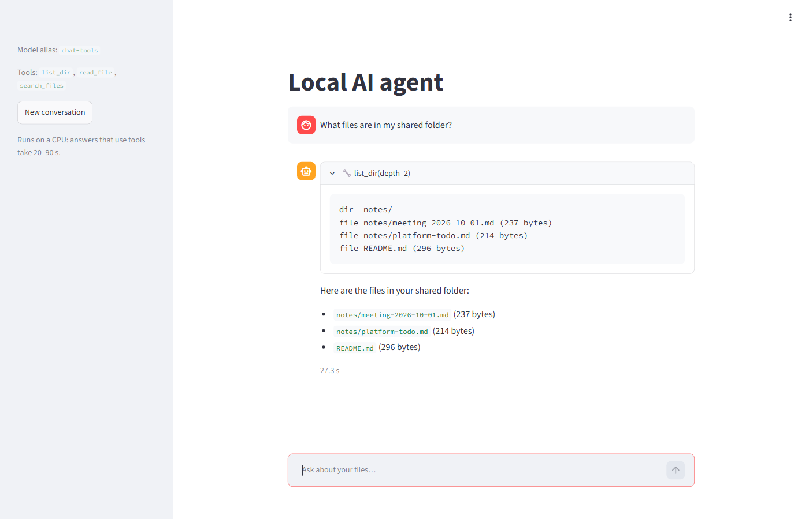 | 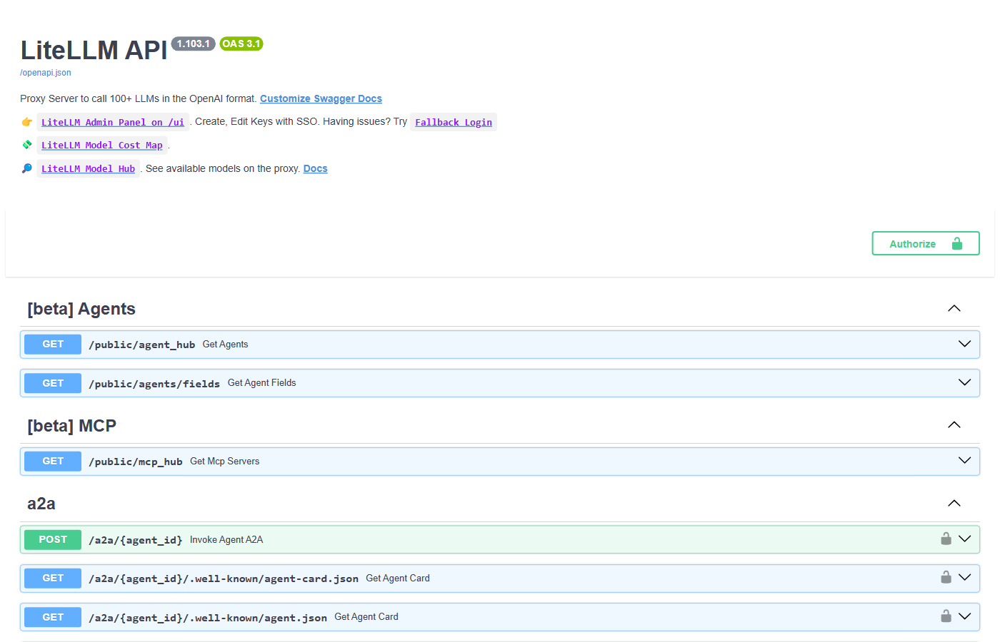 |
| **Qdrant dashboard: collection `docs`, 65 chunks, 768-dim cosine** | **Open WebUI sign-in (https://chat.ai.local)** |
| 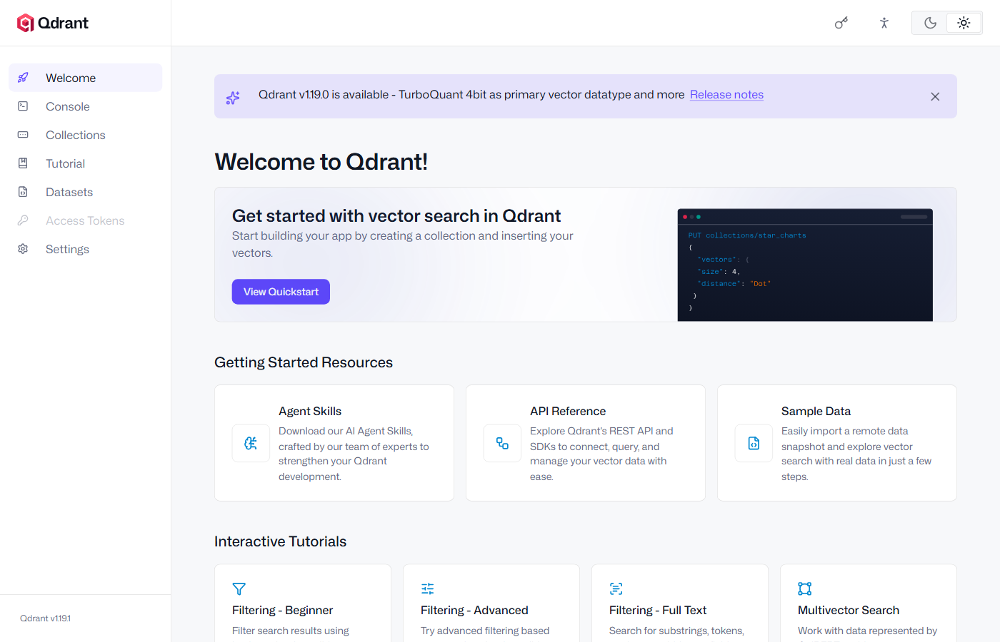 | 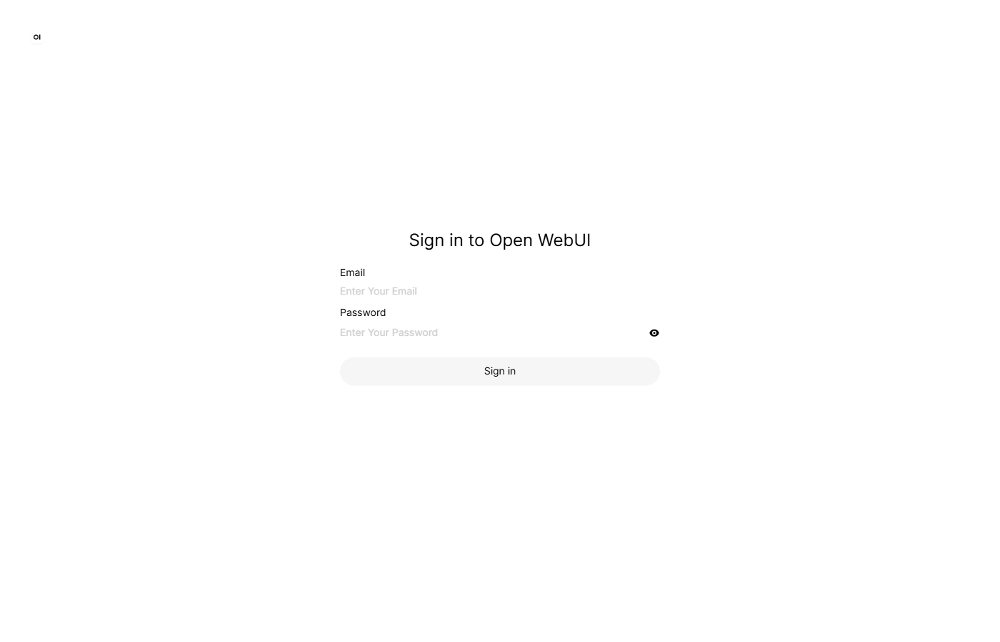 |
| **Headlamp token login (https://headlamp.ai.local)** | **MLflow registry: `message-triage` v1, alias `champion`, test F1 0.9759** |
| 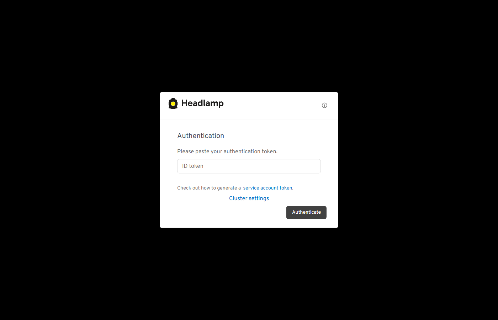 | 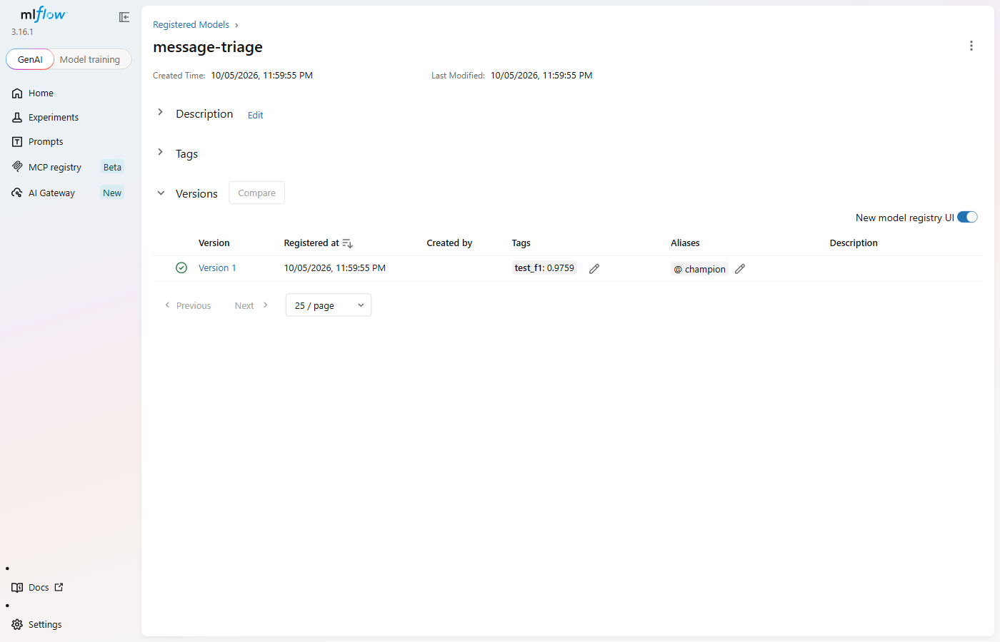 |
| **Dagster: `triage_model` materialized, check passed, nightly 02:00 GMT+4** | **SeaweedFS admin sign-in (https://s3.ai.local)** |
| 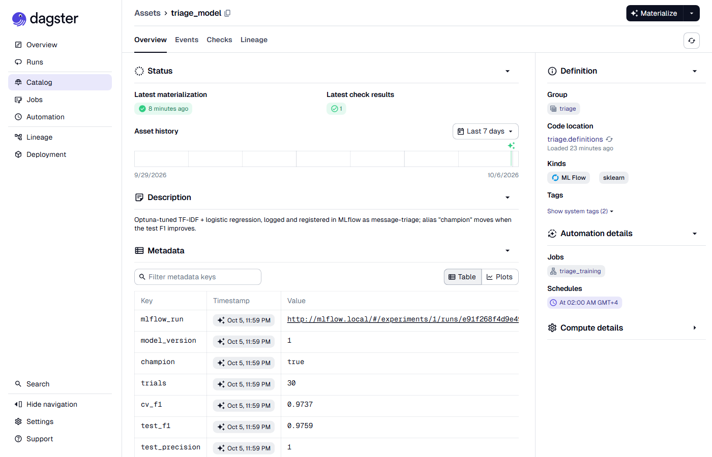 | 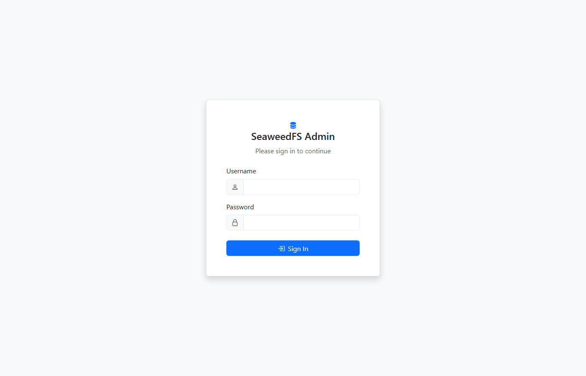 |
| **Single sign-on: https://auth.ai.local, trusted certificate (6.14)** | **BentoML message classifier (6.15)** |
| 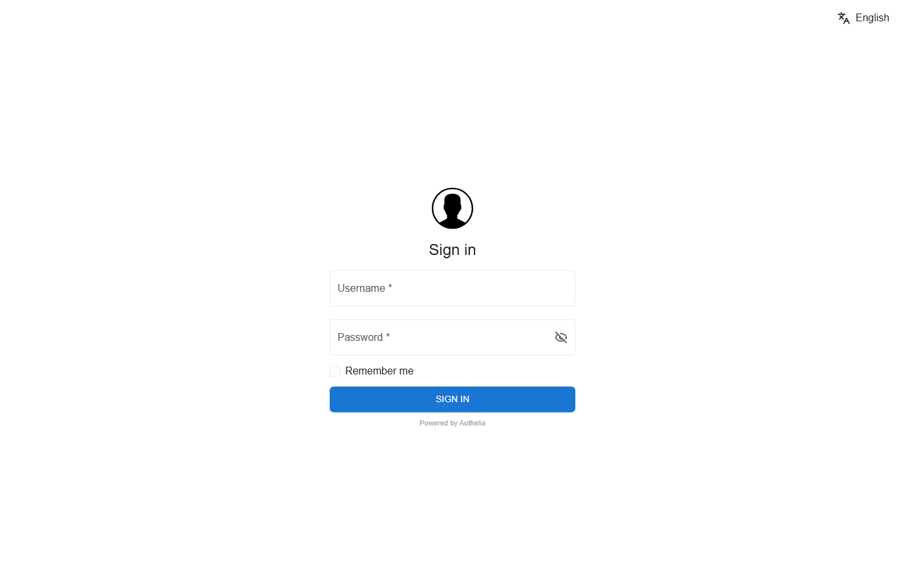 | 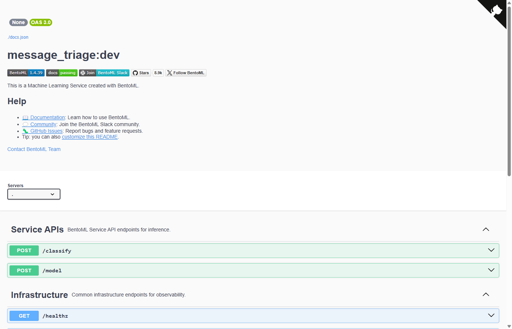 |
| **Grafana: Platform overview (memory, CPU, requests per UI)** | **Phoenix: traces for `agent` and `litellm`** |
| 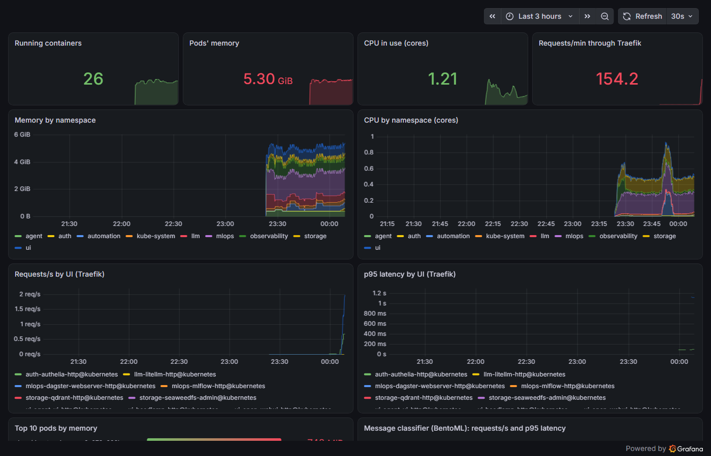 | 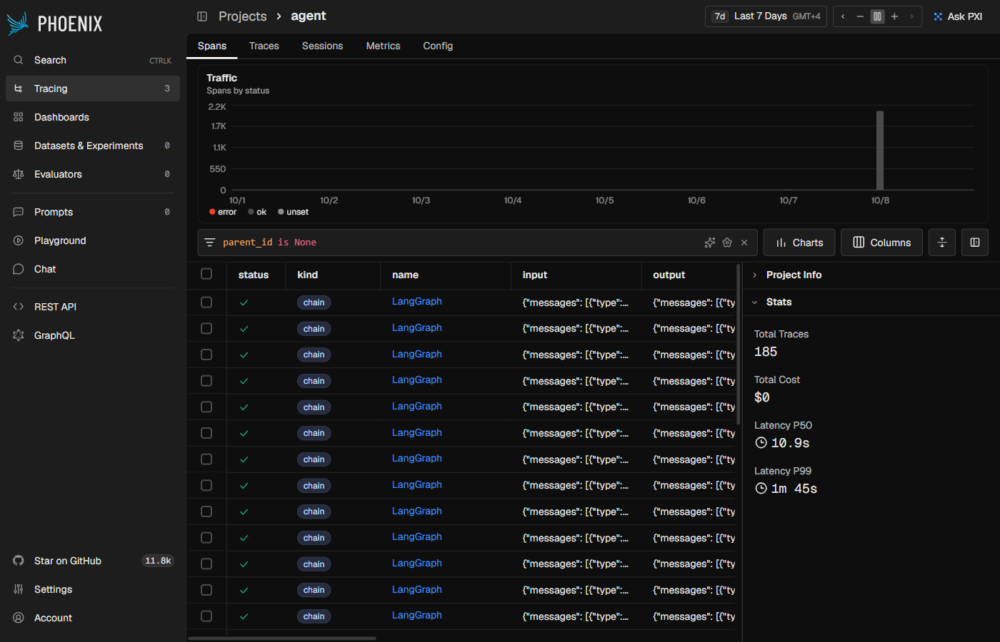 |
| **n8n: owner account setup (second layer behind sign-on)** | **GitHub Actions: ci and build green** |
| 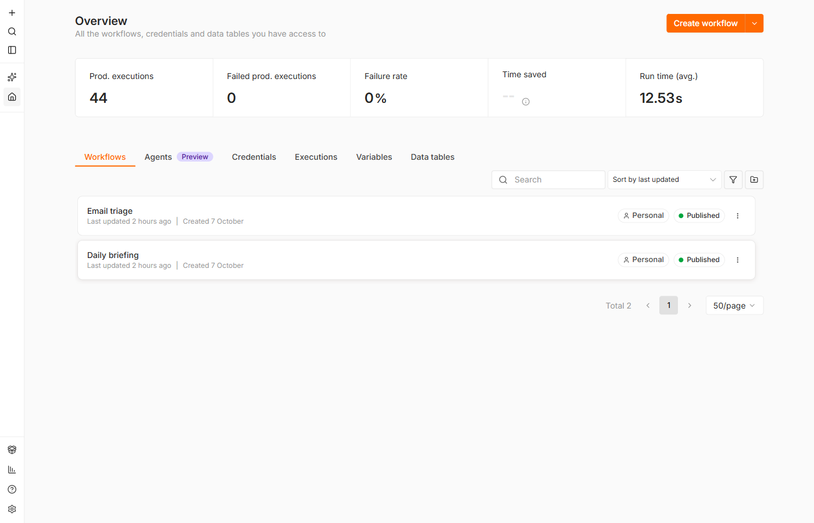 | 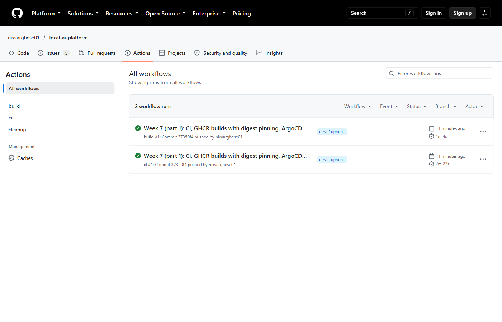 |
| **ArgoCD sign-in (second layer behind sign-on)** | |
| 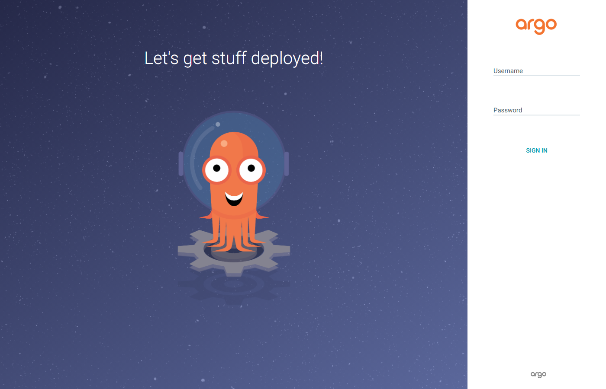 | |

### 10.5 Planned (not deployed yet)

Their hosts entries already exist; until the service is deployed the URL returns Traefik's `404`.

| Service | URL | Week |
|---|---|---|

---

## 11. Non-Functional Requirements

- **Privacy:** all inference and data stay on the laptop; no external LLM APIs. LiteLLM can route to hosted models, but none is configured by default.
- **Cost:** $0 — only open-source software and GitHub free tier.
- **Hardware:** runs CPU-only on 32 GB RAM; no GPU dependency.
- **Reproducibility:** full platform deployable from the repo (`kubectl apply` or ArgoCD sync).
- **Observability:** every agent run and LLM call traced in Phoenix; Traefik, containers and the model server scraped by Prometheus, shown in Grafana.
- **Resource safety:** all pods have requests/limits (namespace defaults in `limits.yaml`); Ollama capped at 4 cores and one request at a time.
- **Extensibility:** new tools added as MCP servers without changing agent core.
- **Security:** secrets kept out of Git (Kubernetes Secrets / sealed secrets); no inbound ports exposed.

---

## 12. Thermal Management

| Action | Expected impact | How |
|---|---|---|
| Undervolt CPU (-100 mV) | 10–20 °C cooler | Only if your BIOS allows it (ThrottleStop / Intel XTU). Many laptops since 2020 lock it (Plundervolt fix); the reference Dell does |
| Limit max CPU state to 80% | 5–10 °C cooler | [`windows-thermal.ps1`](infra/scripts/host/windows-thermal.ps1); anything under 100% also turns Turbo Boost off. Undo with `-Max 100` |
| Ollama: hard CPU cap | 5–10 °C cooler | [`03-ollama-config.sh`](infra/scripts/host/03-ollama-config.sh): `CPUQuota=400%`, `OLLAMA_NUM_PARALLEL=1`. There is no `OLLAMA_NUM_THREADS` setting; Ollama already uses one thread per physical core |
| k3s resource limits | Prevents load spikes | Per-pod limits, plus namespace defaults in [`limits.yaml`](infra/k3s/limits.yaml) (max 2 CPU per container) |
| Start the platform only when needed | No idle heat | `platform.ps1 up` / `down` ([6.6](#66-start-and-stop-the-platform)) |
| Cooling stand (e.g. TopMate C302) | 10–18 °C cooler | Physical |
| Elevate back of laptop | 5–8 °C cooler | Physical |
| Schedule training at night | Heat when ambient is cool | Dagster schedule `triage_nightly`, 02:00 local; one run at a time, max 2 CPUs ([6.13](#613-training-pipeline-mlflow--dagster--optuna)) |
| Monitor with HWiNFO / Core Temp | Know actual temps | Windows-side tool; `sensors` does not work inside WSL, and Windows needs admin rights to read temperatures |

On the reference machine (i7-9850H) the 80% cap slowed a short Ollama reply from ~10.9 s to ~13.8 s, including model load.


**Measured (2026-10-08, i7-9850H, all profiles on)** with [`windows-temps.ps1`](infra/scripts/host/windows-temps.ps1) (LibreHardwareMonitor, open source; `-Load` runs this comparison): idle 59 °C package (max 61), Ollama generating 67 °C average, **70 °C max** at ~26% CPU (the Ollama thread cap), 30 °C below the 100 °C limit. Run `.\infra\scripts\host\windows-temps.ps1` any time for current CPU, GPU and SSD temperatures.
---

## 13. 8-Week Build Plan

| Week | Focus | Deliverable |
|---|---|---|
| 1 | k3s + Ollama + Qdrant | Chat works ✅ |
| 2 | LangGraph + filesystem MCP | File agent ✅ |
| 3 | RAG (LlamaIndex + Qdrant) | Doc Q&A ✅ |
| 4 | MLflow + Dagster + training | Model trained ✅ |
| 5 | BentoML + agent integration | Model exposed as agent tool ✅ |
| 6 | n8n + Phoenix + Prometheus/Grafana | Automation + traces ✅ |
| 7 | ArgoCD + GitHub Actions | GitOps CI/CD ✅ |
| 8 | Voice + OCR + docs + demo | Full platform ✅ (demo script: [docs/DEMO.md](docs/DEMO.md)) |

### Definition of done per week
- Manifests committed under `infra/k3s/`
- Service reachable at its `*.ai.local` URL
- Tests in `tests/` pass in CI
- Short notes added under [`docs/notes/`](docs/notes/README.md)

---

## 14. Key Decisions

- ✅ Monorepo (not split repos)
- ✅ k3s in WSL2 (not Docker Desktop)
- ✅ 3B models (no GPU needed)
- ✅ ArgoCD GitOps (no inbound access)
- ✅ GitHub Actions + GHCR (free tier)
- ✅ MCP-based tools (standard, extensible)
- ✅ ~13.7 GB core RAM (fits the 18 GB WSL allocation)
- ✅ Ollama on the WSL host, not in k3s (simpler, one copy of the models)
- ✅ LiteLLM gateway in front of all models: apps use aliases, so switching or adding a model is a config change
- ✅ No vLLM (needs a supported GPU; on CPU it's slower than Ollama)
- ✅ 8-week build plan
- ✅ Fully self-hosted, private, free

---

## 15. Open Issues and Risks

| Item | Notes |
|---|---|
| Ollama placement | **Decided:** WSL host (systemd), reached by pods at `http://ollama.llm.svc.cluster.local:11434`. Trade-off: ArgoCD doesn't manage Ollama; its settings live in [`03-ollama-config.sh`](infra/scripts/host/03-ollama-config.sh). The `10.42.0.1` address in `llm/ollama-host.yaml` assumes k3s's default pod network on a single node. |
| Tracing footprint | **Decided:** Phoenix (~0.5 GB, one container + SQLite) instead of Langfuse v3 (~1.5–2 GB: web, worker, ClickHouse, Redis). Phoenix has no prompt management or annotation queues like Langfuse; traces, latency and token counts are covered. |
| ArgoCD memory | 1.3 GB is significant; consider disabling Dex/notifications or using ArgoCD core mode. |
| GHCR 500 MB limit | **Resolved:** images are public (the repo is), so no storage limit and no pull secret; `cleanup.yml` keeps 10 versions each. |
| Voice/OCR tooling | **Decided:** faster-whisper `base` + Piper (own OpenAI-compatible server, profile `voice`), Tesseract for scanned PDFs and images ([6.18](#618-voice-and-ocr-whisper-piper-tesseract)). |
| Workflows not built | **Resolved:** memory (1), calendar (5), web research (6) and planning (7) are built ([6.19](#619-memory-calendar-web-research-and-planning-agent)); all ten workflows run. |
| Email/Calendar access | The calendar reads `.ics` files and read-only feed URLs (a Secret), so no OAuth is needed; adding events writes the local `agent.ics`, not Google/Outlook. Two-way sync or an IMAP mailbox for workflow 4 would need the provider's OAuth credentials as Secrets. |
| Web research privacy | The only feature that sends data off the laptop: search queries go to the search engines through SearXNG, and pages are fetched from their sites. It's in its own profile (`research`), off unless you turn it on. |
| Multi-step latency | A request with two parts (workflow 7) takes 34–39 s on CPU against a 15–30 s target: each part is a full question with its own model calls. Parts are split by words ("and then"), so a request phrased without them runs as one question. |
| 3B model quality | `qwen2.5:3b` (the default active model) calls tools reliably once the prompt gives explicit steps and the tools tolerate wrong paths; `llama3.2:3b` is weaker. Still seen: answers padded with loose summary, and the odd unneeded tool call. Re-test after changing the model or prompt (the `make status` agent and RAG checks, or the questions in 6.10 and 6.12). |
| Agent latency | File search (workflow 2) measures 10–25 s, not the 2–4 s target: each tool call is a full model round trip on CPU. Document Q&A (workflow 3) avoids the round trip and measures 3–11 s against 3–5 s ([6.12](#612-document-qa-rag-llamaindex--qdrant)). |
| Image sizes | Our images total 3.6 GB on disk after the shared `ml-base` (5.1 GB before); `pipelines` (Dagster + Evidently) is still 1.8 GB. The k3s image store was 26 GB before `k3s crictl rmi --prune` (19 GB after, mostly third-party: Open WebUI, LiteLLM). |
| Spam model scope | The message-triage model is trained on SMS spam (prize, premium-number, "text WIN to..." messages) and catches those well (test F1 0.976). Phishing e-mails ("your account is locked, verify at paypa1-verify.top") score as ham (~0.33): the training data has no e-mail phishing. Fix: add an e-mail phishing dataset to the pipeline (same Dagster/Optuna/MLflow path), or let the LLM step in workflow 4 flag suspicious links. Until then, treat a "not spam" verdict on an e-mail as "not known spam". |
| Nightly training | Runs only if the platform is up at 02:00; missed nights aren't replayed. Same data + fixed seed give the same score, so the champion only changes when the data or the search space does. |
| Single sign-on | **Resolved:** every UI is behind Authelia over HTTPS ([6.14](#614-single-sign-on-and-https-authelia)). One factor (password) for now; switch the rule to `two_factor` before exposing anything beyond this PC. The local CA's private key (`/var/lib/local-ai-ca`, root-only in WSL) can sign certificates your browser trusts: keep it there, and remove the CA with `windows-trust-ca.ps1 -Remove` if you retire the platform. |
| RAG routing | The agent skips retrieval for "which/what files..." and "list ... notes/files" questions (a regex in [`graph.py`](agent/graph.py)). Questions phrased otherwise go through retrieval, and the model can still answer them from passages instead of listing the folder. Unknown facts get a clumsy "I don't have access" rather than "I don't know". |
| WSL networking | **Resolved:** Traefik listens on the WSL host's ports; hosts entries point at `127.0.0.1`, which Windows port proxies forward to the `[::1]` WSL relay ([6.7](#67-local-dns-for-local-hostnames)), so neither a changing WSL IP nor a network without IPv6 matters. Needs WSL's default NAT mode with `localhostForwarding=true` and the IP Helper service. |
| Disk space | Keep the distro (and so models, images, volumes) on a drive with ~100 GB free; the assessment checks this. On the reference machine it lives on a second SSD. |
| Windows memory pressure | Mitigated with `memory=18GB`, but steady-state headroom inside WSL is only ~4.3 GB. Watch it as services are added. |
| LiteLLM image | **Pinned** to `v1.103.1` (tag + digest) in [`llm/litellm.yaml`](infra/k3s/llm/litellm.yaml). Upgrade deliberately: change the tag, apply, run `make status`. No master key: fine while the API is reachable only from this PC, but add one (a Secret) before exposing it. |
| Open WebUI config | **Resolved:** settings come from env vars on every start (`ENABLE_PERSISTENT_CONFIG=false`), so Admin Panel changes don't survive a restart ([6.9](#69-llm-gateway-litellm-switching-and-adding-models)). |
| Pod restart counts | **Resolved:** `up` replaces the previous run's pods ([6.6](#66-start-and-stop-the-platform)), so `RESTARTS` counts only crashes in the current run. |

---

## 16. Deliverables

- Local AI agent platform running on k3s
- End-to-end workflows: 6 working (2, 3, 4, 8, 9, 10), 2 partly (1, 7), 2 not built (5, 6); see §9
- MCP-based tool system
- RAG + classical ML
- Full MLOps (MLflow, Dagster, BentoML, Optuna, Evidently)
- LLMOps / AIOps (Phoenix, Prometheus, Grafana, n8n)
- k3s + ArgoCD GitOps
- GitHub Actions CI/CD to GHCR
- Portfolio-ready repo with docs ([weekly notes](docs/notes/README.md)) and a demo script ([docs/DEMO.md](docs/DEMO.md))
- Hands-on skills: agents, MCP, Kubernetes, LLMOps

---

## License

[MIT](LICENSE) © 2026 Nixon Varghese
